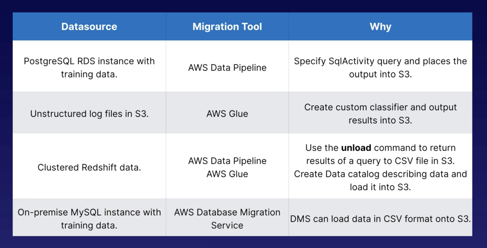

# Data Collection

*Machine Learning Cycle* represents the iterative process of ML:

Goal: Understand the problem at hand, understand the parts of our input data, map our data into AWS

## Data Collection Concepts

#### ML - questions to ask

1. What type of generalisation are we seeking? What type of answer are we looking to get to?
2. Do we really need ML?
3. How will my ML generalisation be consumed?
4. What do we have to work with?
5. How can I tell if the generalisation is working?

#### Data

General rule of thumb - you should have at least 10 times as many data points as the total number of features.

Where does data come from?

- No matter how you get your data, you are aiming to build a single data repository.

## Data Terminology

*Datasets* - input data = training/testing data (in ML)
*Column/Attribute* - feature of the data
*Row/Observations* - different data points in the dataset
*Structured Data* - defined schema - schema is info needed to interpret the data e.g. attribute names and their 
assigned data types 
*Unstructured Data* - no defined schema or structural properties. This makes up the majority of data collected e.g. 
images/pdf's/videos etc
*Semi-structured Data* - too unstructured for relational data, but has some organisational structure e.g. 
No-SQL data, data usually in csv/json/xml format.

*Database* - single repository for applications or other services that are transactional.
Whenever we write to a transactional database, if there is an error, the changes are rolled back. 

*Data Warehouse* - collect data from many different sources and in many different formats and congregate them together 
in a data warehouse. Traditional, before the data lands into the Data Warehouse there is some processing/cleaning of 
the data before it lands in the Data Warehouse. This is so we can run analytics/use BI tools etc from the data in the 
Warehouse. Warehouses are used to stores large volumes of data that we can analyse more easily.

*Data Lake* - Store mass amounts of unstructured data that are dumped into a Data Lake (single repo). Traditionally 
there is no processing done before putting data into a Data Lake. Data Lakes are often used to store historical data or
data we are not sure what to do with it yet etc. 

## ML Data Terminology 

**Labelled Data** - data where we already know what the target attribute is

e.g. Emails - are they spam or not spam.

e.g.2. Image data 

**Unlabelled Data** - data that is collected with no target attribute

e.g. Audio Streams/log files/Twitter streams

Further examples of labelled vs unlabelled data:

Note - the majority of the time, supervised learning is done with labelled data and unsupervised learning is done with
unlabelled data.

**Categorical vs Continuous Features**

#### Different types of data

1. Test Data (Corpus Data) - datasets collected from text - used in NLP, speech recognition, text to speech etc.
2. Ground Truth Data - datasets that refer to factual data/data that has already been successfully labelled and can be
trusted as 'truth' data.
    - **Amazon SageMaker Ground Truth** - tool that helps build ground truth datasets by allowing different types of 
    tagging/labelling processes - allows us to easily create labelled data.
3. Image Data - refers to datasets with tagged images. Used for: analysing facial/action recognition, object detection,
gender classification. Several image repos out in the web that already have 1000's of images already tagged that can be
used e.g. MNIST data for letters or Image Net for other general image classification. 
4. Time Series Data - refers to datasets that capture changes over time e.g. Stock Market Prices or sensors in IoT
devices or web traffic or log files.

Summary:

## AWS Data Stores

How to get our data into AWS?

**At the core of all this - how do we get our data into S3?**

#### Amazon Simple Storage Service (S3)

Unlimited data storage that provides object based storage for any type of data.
Go to place for ML data. This is because the core services that AWS offers for ML integrate directly with S3. S3 is 
also used to output results of anything we create within our ML process

* Files can be 0 bytes to 5 TB
* There is unlimited storage - more resources automatically provisioned as required
* Files are stored in buckets
* S3 is a universal namespace - unique globally 
* https://s3-{region}.amazonaws.com/{bucketname}
* 2 ways to address endpoints:
    * Path style (as above) - this model ended September 2020.
    * Virtual Hosted style - https://{bucketname}.s3.amazonaws.com

How to get data into S3?

1. AWS Console
2. AWS SDKs -
    a) via code
    b) via CLI
    
#### Amazon Relational Database Service (RDS)

This is for relational databases. 

RDS has the following engines to choose from to create a fully managed relational database:

#### Dynamo DB

No-SQL data store for non-relational databases - used to store key-value pairs.

#### Amazon Redshift

Fully managed, clustered, petabyte data warehousing solution that congregates data from other data sources e.g. S3,
Dynamo DB etc.

It allows you to store mass amounts of data. Once your data is in Redshift you can use SQL Client tools/BI/Analytics
tools to query that data etc. 

*Redshift Spectrum* - feature within Redshift that allows you to query your Redshift cluster that has sources of S3 data.
i.e. allows you to query your S3 data. Could then use AWS QuickSight etc to create charts to visualise that data.

#### Amazon Timestream

Only announced in 2018, so unlikely to be on exam. 

Fully managed time series database service. Allows you to 'plug-in' BI tools and run queries on time series data.

#### Document DB

Only announced in 2019, so unlikely to be on exam. 

This is a place to migrate mongoDB data - provides better performance and scalability than traditional mongoDB instances
running on, for example, EC2, or on prem.

## AWS Migration Tools

Tools we can use to help get our data into S3 so it's ready for our ML process.

Common exam questions - which tool to use to get data from 1 location to another?

#### Data pipeline

Allows you to process and move data between different compute and storage services. Also allows you to transfer data
from on prem onto AWS.

Data pipeline offers several built in activity objects that allow us to copy data using different activity types:

Can use these activities and specify which type of data source we have and how we want to migrate our data. We can set
up these pipelines to either run on schedule or on demand.

Data pipeline can also be used as a transformation tool, but in this context we are just talking about moving data from
one location to another and within data pipeline you can manage the pipeline execution, the resources that actually 
transfer the data (i.e. EC2 instances), and any retry logic or failure notifications if a transfer is not successful. 

Within the AWS Console there are several built-in templates that you can use when creating your pipeline. You can
also provide your own templates for custom pipelines that you build yourself. 

#### Database Migration Service (DMS)

This service allows you to migrate data between different database platforms.

This is generally used for transferring data between 2 different relational database services, but you can also
output the results onto S3. 

DMS supports homogenous and heterogeneous migrations, meaning if you wanted to transfer data from MySQL to MySQL that's 
okay, and you can also transfer data from for example SQL Server to S3 or SQL Server to MySQL. 

DMS doesn't support really any transformations, other than maybe something like a column name change, but traditionally
this wouldn't be used as a transformation tool. 

You can set up a source endpoint for any of these types of sources and then have the data output on any of the target
endpoints:

*Main difference between Data pipeline and DMS* - DMS handles all the heavy lifting for you when it comes to resources
that are required to transfer the data. Data pipeline allows you to set up your resources as needed and handles the
transferring of data in more of a custom way. 

#### AWS Glue

This is a fully managed ETL (Extract, Transform, Load) service, but we are going to focus on the loading part of this 
here whilst talking about loading data. (Go into AWS Glue in much more depth later on).

When using AWS Glue, it creates tables within a data catalogue that are like a 'skeleton' for our dataset. It's 
essentially the metadata and data types and attribute types that make up our datasets.

 
To create these tables within AWS Glue we set up a **Crawler** - this goes out, looks at the data and determines the
schema associated with that data. Within these Crawlers, there's several different classifiers that work at a 
hierarchy level and go down the line to try and infer what type of data/schema it is. This allows us to build a skeleton
of some type of schema associated with our data, even if we have unstructured data etc. 

If a Classifier can't recognise the data, or it isn't 100% certain, the Crawler invokes the next Classifier and try's 
again. Think of these Classifiers as similar to regular expressions looking for certain things in our data. 

Can also create custom Classifiers to specifically lay out what your data looks like. 

Summary - we can use AWS Glue to load our data from one data source to another. During the loading process, we can
change the output format to any of the formats below to get it ready for our ML model. 

#### Choosing the Right Approach for Data Migration

## AWS Helper Tools

Tools that can help us get our data into AWS and also help us store our data within AWS. 

#### Elastic Map Reduce (EMR)

EMR is a fully managed Hadoop cluster ecosystem that runs on multiple EC2 instances.

It allows you to pick and choose different frameworks that you want to include within the cluster. This 
allows you to run distributed workloads over many EC2 instances if you have very large quantities of data. Most of
these products/frameworks are open source and EMR allows you to assemble all/some of them together to do 
different things. 

In our case, we could use EMR to store mass amounts of files in a distributed file system to use as our
input data. If our data is already within an EMR cluster, we can use some of the frameworks and services to 
migrate the data into S3 or we can use services such as AWS Data pipeline to load the data into S3. 
(We will discuss the EMR ecosystem in more depth later during 'Data Preparation'.)

#### Amazon Athena 

Serverless platform that allows you to run SQL queries on S3 data.

We can essentially set up a table within our data catalogue within AWS Glue and use Athena to query our S3 data. 
Within the console, we can select tables that are defined within our AWS Glue Data Catalogue. We can output the
query results onto S3/into a csv file etc:

*What is the difference* between Redshift Spectrum and Athena

## Exam Tips

