# Streaming Data Collection

Data can be thought of as static or streaming.

*Note - places to find open source static datasets: Kaggle, UCI Machine Learning Repository, Open Data on AWS
(organisations can upload their data onto AWS and make it public for everybody to access and use etc),
Google's BigQuery (can run queries on big datasets and return the data in any format you would like)*

## Streaming Data

Examples:
* Sensors in transportation vehicles or industrial equipment
* Farm machinery 
* Stock market prices - computing things like value at risk and automatically balancing portfolios
based on those real-time stock market movements
* Real estate websites - tracks customers and makes real-time property recommendations
* Online gaming companies - collect data about game player interaction and feed that data back into the gaming platform. 

**How do we get our streaming data into AWS?... and into our ML process?**

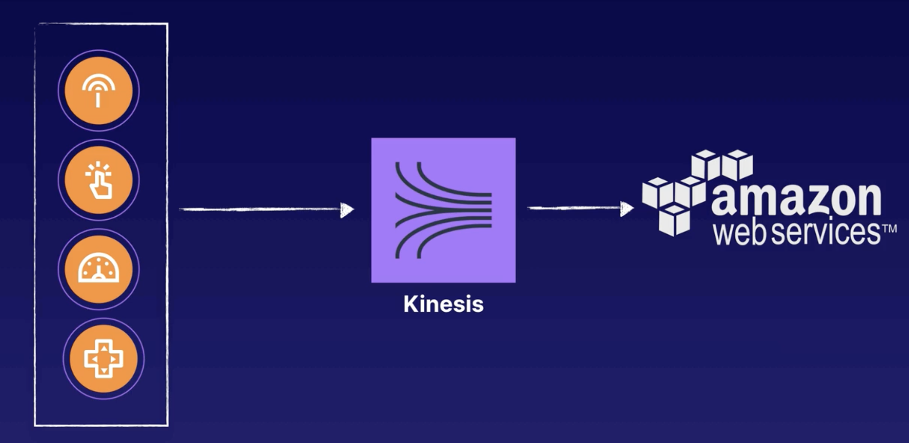

Think about Kinesis as a family of tools - it consists of several different services that make up the entire
Kinesis streaming family:

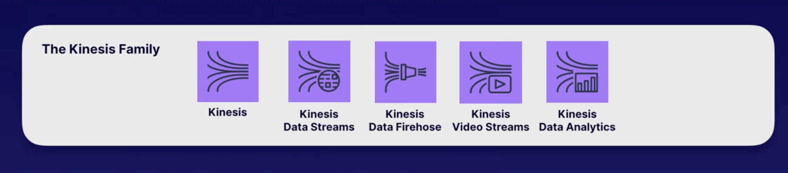

## Kinesis Data Streams

This works by getting data from data producers, which tend to typically have json data as the payload. They can have any
type of data that they can fit into a data blob. Data producers are different physical devices/applications that produce
streaming data e.g. application log files/social media streams/IoT devices data. 

Once the data is produced, we can then use Kinesis Data Streams to 'stream' that data into AWS. Kinesis Streams
carries the data by using Shards (containers that hold the data we want to send into AWS). Shards are made up of several
different parts, that we will discuss in more detail below. 

Once the data is contained with a shard, then we use Data Consumers to process/analyse that data (see image below). We 
can have multiple consumers consume the data stream and perform different processes depending on the job at hand.

Note - when using Kinesis Data Streams, need that intermediate Data Consumer to take the data and output it on S3 etc - 
for example can use AWS Lambda.

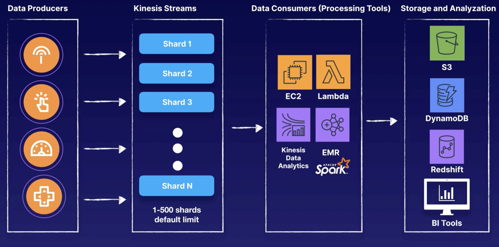

### Shards

These are the containers that contain all of the streaming data that we want to load into AWS.

Shards have unique partition keys. Each time we request to send streaming data through Kinesis Streams, 
it creates a sequence (in the diagram below, a red box). These sequences are associated with a specific Shard. The more 
requests we make and the larger the data payload gets, determines how many Shards you will use. The number of Shards you
can use is from 1-500 by default, but you can request more if needed.

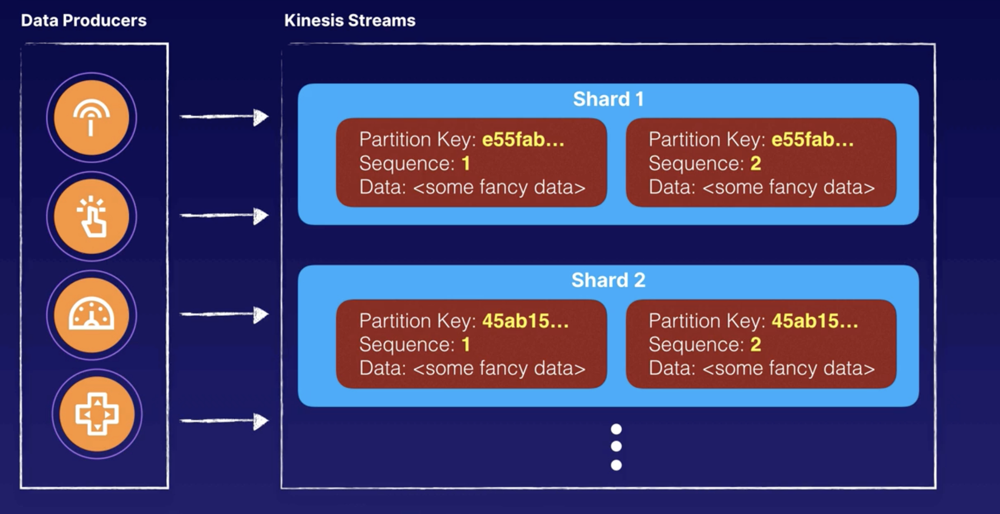

Summary points:

* Each shard consists of a sequence of data records (think about the red boxes). These can be ingested
at 1000 records per second

* Default limit of 500 shards, but can request increase to unlimited shards

* A data record is the unit of data captured, each consists of:
    * A sequence number
    * Partition key
    * Data blob (your payload - can be up to 1 MB)
    
* Shards are a transient data store - retention period for the data records are 24 hours (by default) to 7 days - think
f it like a mini brain that holds onto the information for a short period of time in case required.

### How do we actually get our data into Kinesis Data Streams? (/into a Shard?)

1. Kinesis Producer Library (KPL) - can install this onto EC2 instances or integrate it directly onto your Java apps.
Note - need to implement this using Java, but you don't need to use Java if using the API.
2. Kinesis Client Library (KCL) - once data is in Kinesis Data Streams

^ both of these are used to abstract some of the low level commands that you would need to use if you were using the 
Kinesis API...

3. Kinesis API (AWS SDK) - can perform all the same actions you can perform with KPL or KCL, but it's used for more
low-level API operations/manual configurations

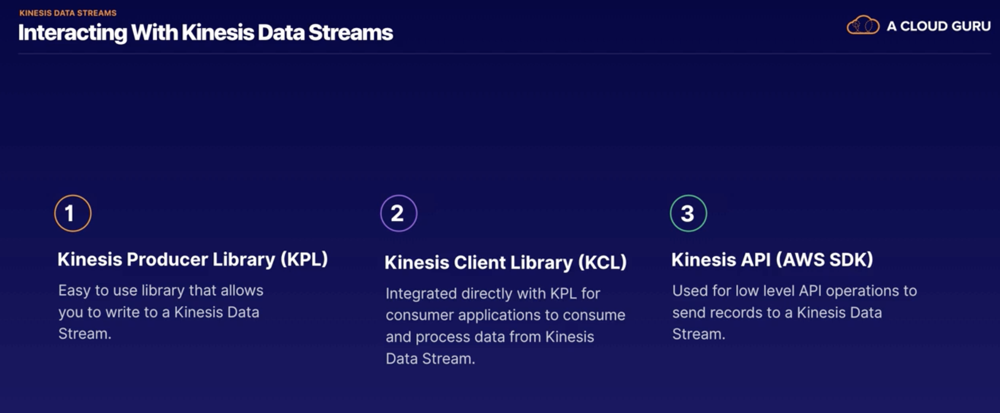

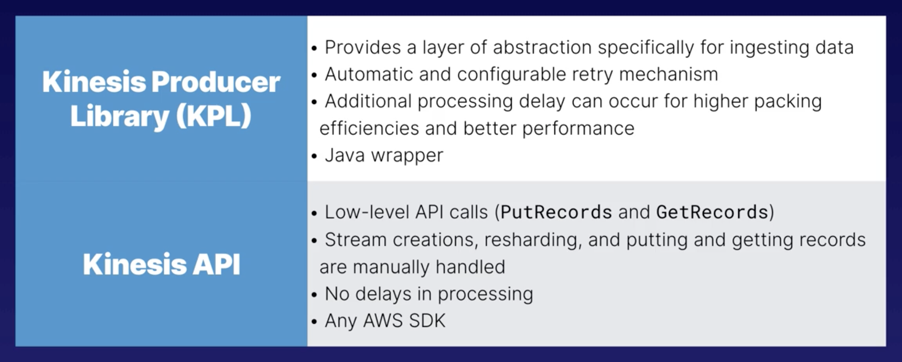

Other notes on Kinesis Data Streams:

* Tool within the console that allows you to estimate the number of shards you will need, depending on the payload size
and number of requests

* Can always reshard - to increase/decreases the number of Shards. This allows for adaptation. Resharding is typically
done by a separate application that monitors the metrics from the Producers and Consumers and makes an API call to add
more Shards if needed. Resharding is considered advanced. 

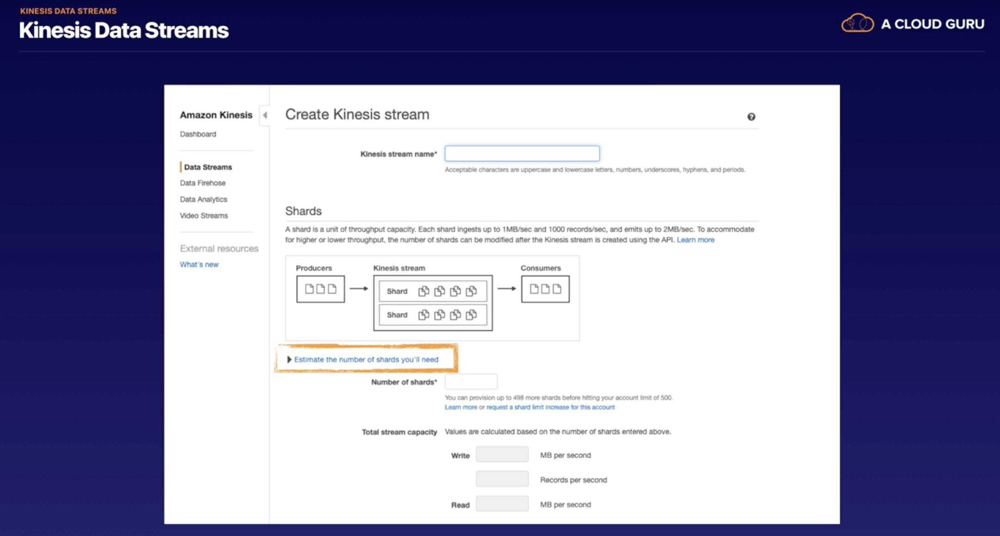

### Use Cases for Kinesis Data Streams

1. Process and evaluate logs immediately e.g. analyse system/application logs continuously and process within seconds
2. Real-time data analytics e.g. run real-time analytics on click stream data (i.e. what a user is clicking on) and 
process it within seconds

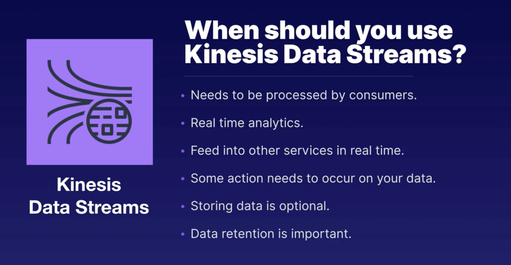

## Kinesis Data Firehose

Similar to Kinesis Data Streams, we get our data from Data Producers.

However, with Data Firehose, we no longer have to worry about Shards. Because of this, we can preprocess the data using,
for example, AWS Lambda, which acts like an ETL Service, right before we land our data on some Data Store. Doing this
preprocessing is optional... you can stream the data directly from Data Firehose to Storage. 

Can also take advantage of S3 Events, which invoke a Lambda function following an 'event' on S3 e.g. 
if we have streaming data landing in an S3 bucket, we can have an S3 Event which invokes a Lambda function to push the 
data onto DynamoDB.

Summary - Kinesis Data Firehose allows you to easily stream data to a final data source/destination.

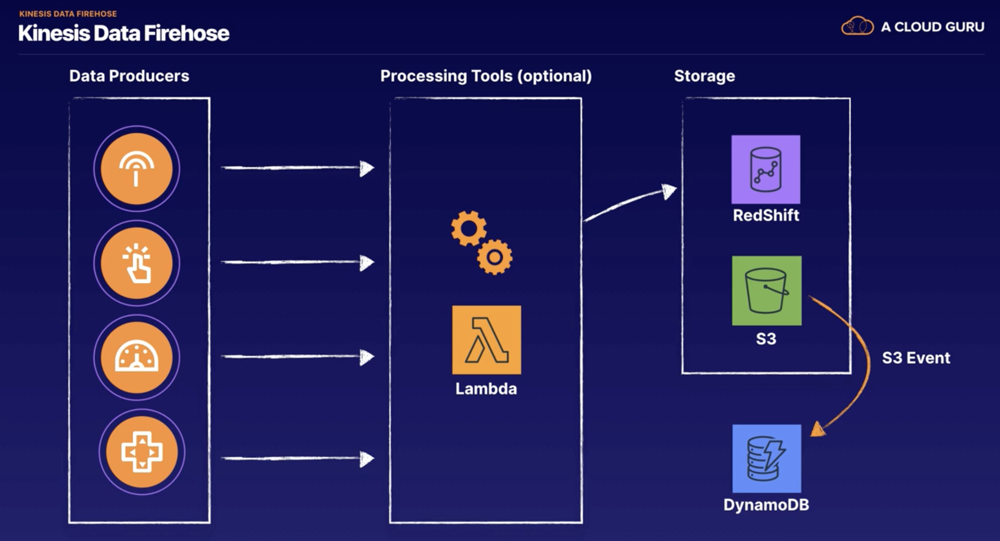

**Note major differences with Kinesis Data Streams - Kinesis Data Firehose - doesn't have shards or data retention and 
with Data Streams, storing data is option, however with Firehose, that is the whole goal!**

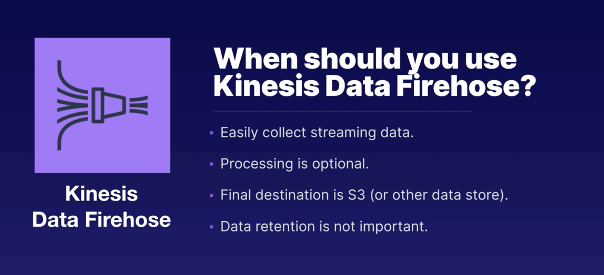

### Use Cases for Kinesis Data Firehose

1. Stream and store data from devices e.g. capture important data from IoT devices, embedded systems, 
consumer applications and storing it into a data lake
2. Create ETL jobs on streaming data e.g. running ETL jobs on streaming data before data is stored into a 
data warehousing solution

## Kinesis Video Streams

A service that allows us to stream videos into AWS. You can build real-time video processing applications.

Can also stream images/audio in real time using Kinesis Video Streams.

Still have Data Producers with Video Streams - these can be web cams/security cameras/audio feeds/images/radar data.
These Data Producers send the data into AWS, where we have different types of continuous/batch consumers - these are the 
applications that will consume and process the video streaming data. 

These Data Consumers get the data in fragments and frames from Kinesis Video Streams to allow them to view, process and 
analyse it. Generally, these Consumers are called Kinesis Video Stream Applications. 

These Applications can either be written to:
1. consume and process the Video Streams in real-time or 
2. process the data after it has been stored on S3 and you know with confidence that it has been durably backed up.

We can write our Consumer Applications on EC2 instances.

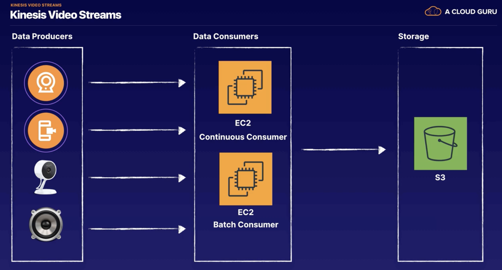

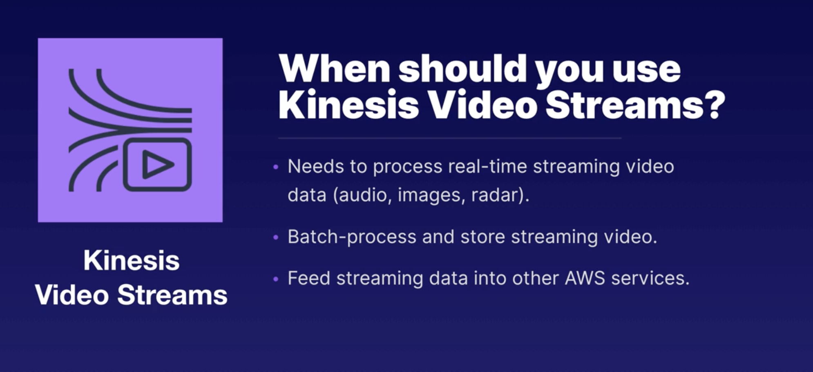

### Kinesis Video Streams Use Case

Amazon Cloud Cam - detects movement and then sends notifications and also stores the videos on S3 so
they can be viewed. (There is also ML set up here as it can recognise a person over some other random object)

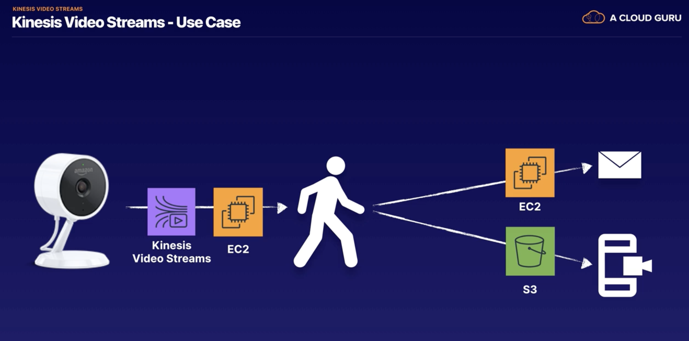

## Kinesis Data Analytics

Allows you to continuously read and process streaming data in real-time. 

We can do this by using SQL queries to process the incoming streaming data and produce some output data from that.

The way this works is:
1. It gets it's input streaming data from services such as Kinesis Data Streams or Kinesis Data Firehose.
2. We then run it through Kinesis Data Analytics, run real-time SQL queries (change datatypes, column names, complex 
joins etc, all in real-time)
3. Outputs into S3/Redshift/other BI/Analytics tools

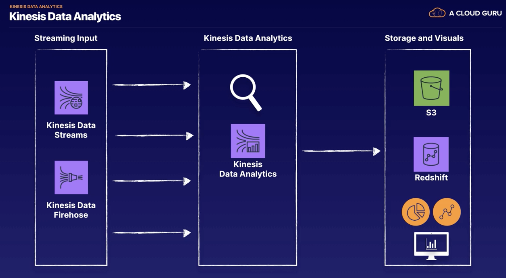

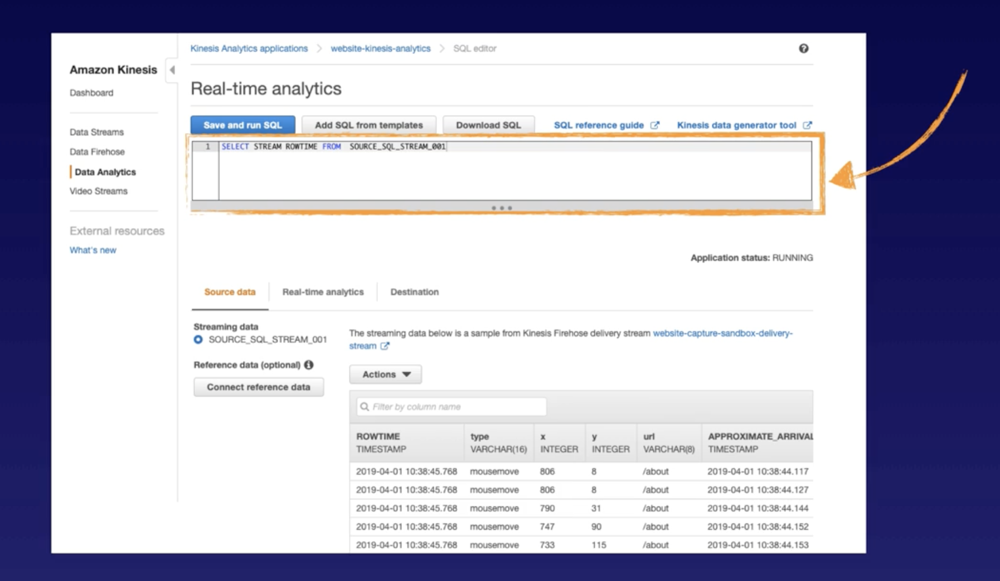

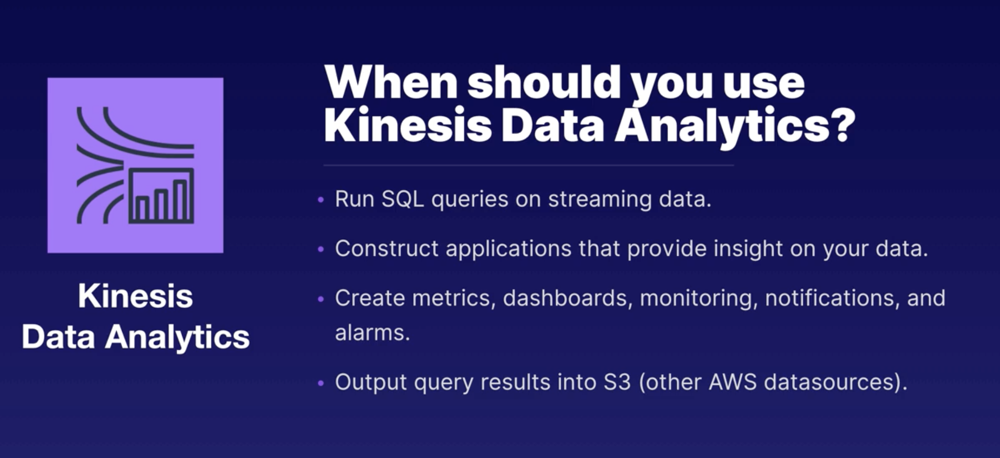

### Kinesis Data Analytics Use Cases

1. Responsive real-time analytics e.g. send real-time alarms or notifications when certain metrics reach predefined
thresholds
2. Stream ETL jobs e.g. stream raw sensor data and then clean, enrich, organise, and transform it before it lands
into a data warehouse or data lake.

## Which Kinesis service to use?

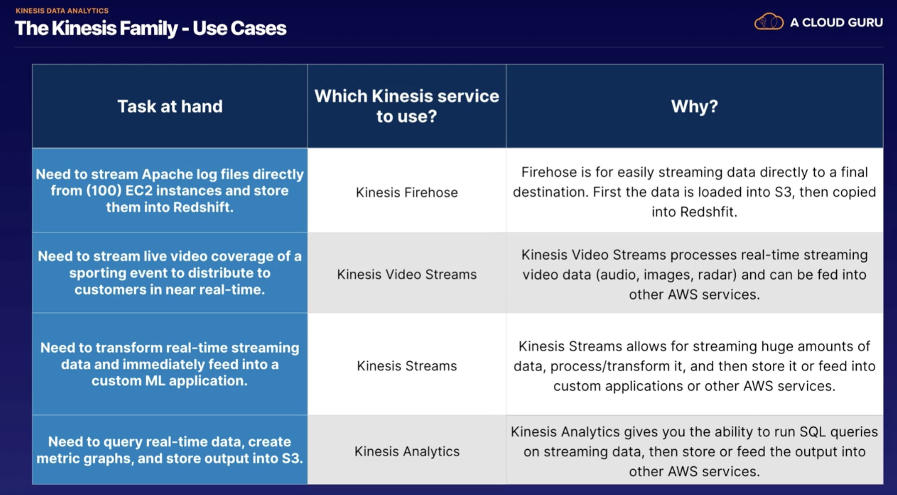

## Exam Tips

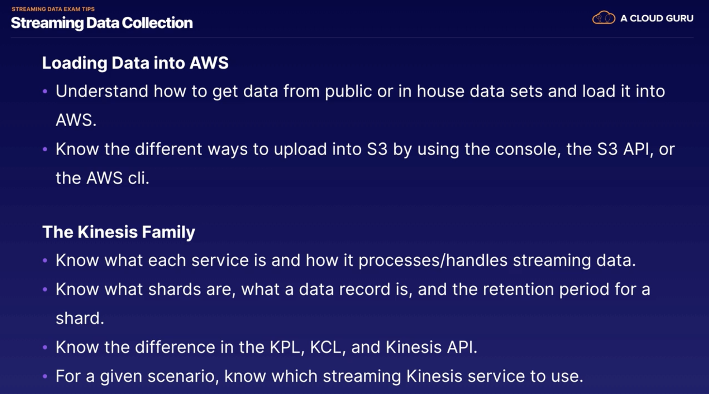

