# Data Analysis and Visualisation

Analyse/Visualise data to make sure it is definitely ready for model training. 

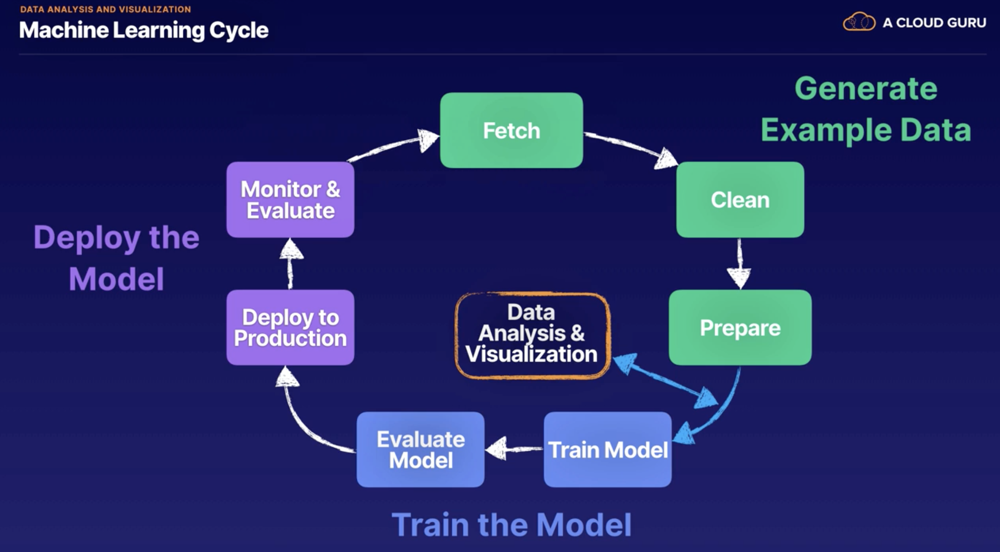

Can get questions in the exam asking for the best type of visualisation to analyse certain types
of data.

4 different categories of visualisations:

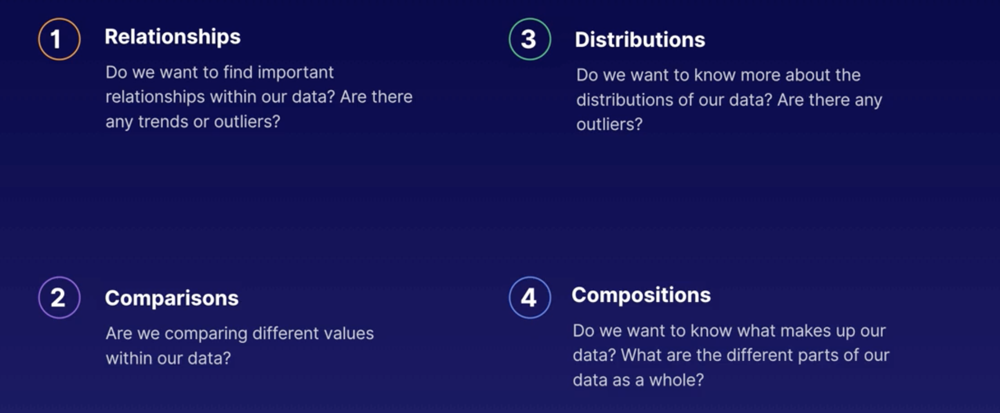

2 main ways to see our data:

### Amazon QuickSight 

- BI tool that makes it easy to create visualisations from your data
- Can create visualisations in the AWS console
- This means we can point Amazon QuickSight to our data input source e.g. data in S3.

## Data Relationships

Visualising relationships in your data can provide a good general overview, show distribution, and correlation
between attributes. Visualising relationships can also help find outliers and extreme values.

2 types of charts we can look at for visualising data relationships:

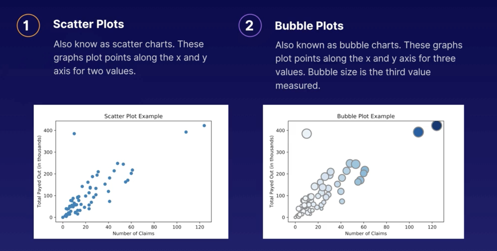

Scatter plots - used to show the relationship between 2 values

Bubble plots - used t show the relationship between 3 values

e.g. for the above Bubble Plot example:

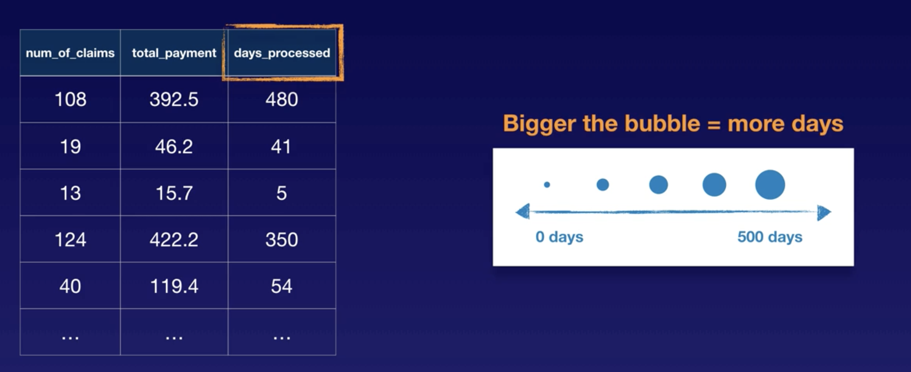

## Data Comparisons

Visualising comparisons in your data can provide a static snapshot of how different variables compare and show
how different variables changes over time. 

2 types of charts for we can look at for visualising data comparisons:

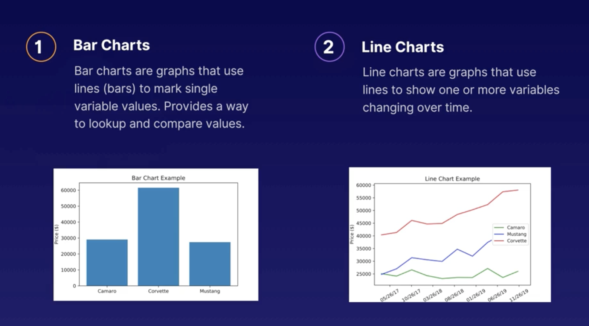

## Data Distributions 

Visualising distributions in your data can show how your data is grouped or clustered over certain intervals. 

3 types of charts for we can look at for visualising data distributions:

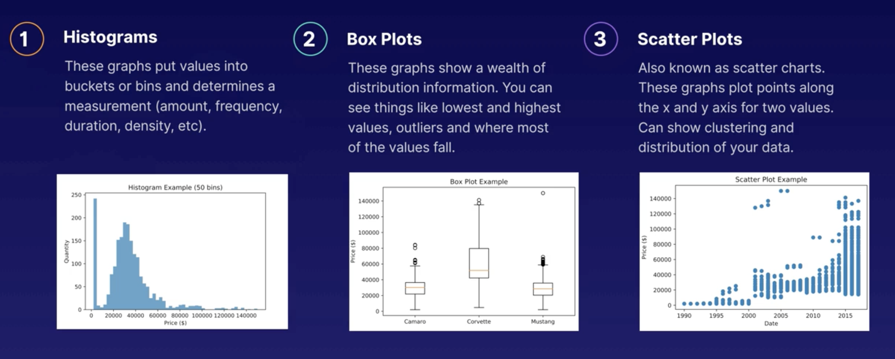

### Box Plots

Components of box plots explained:

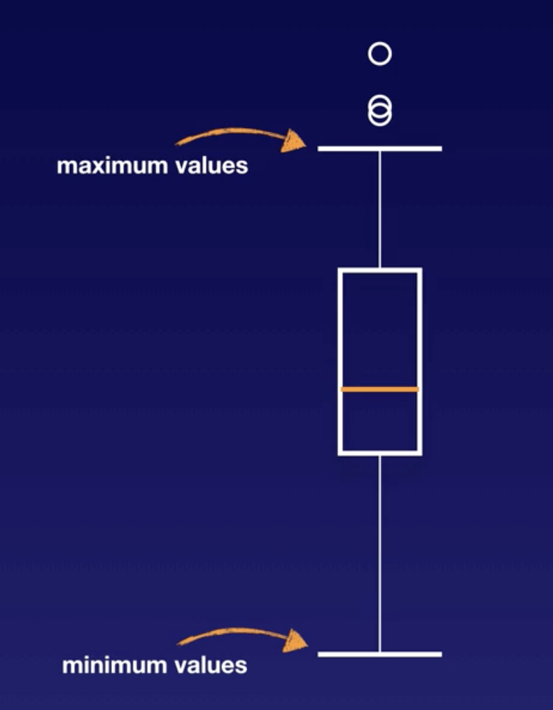 

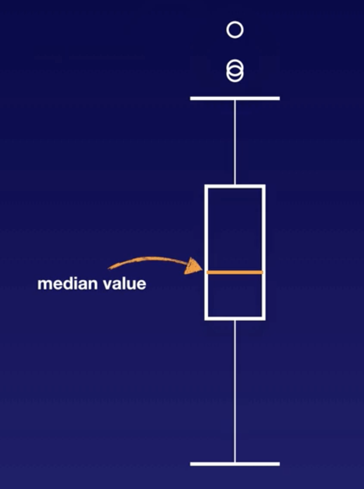 

 

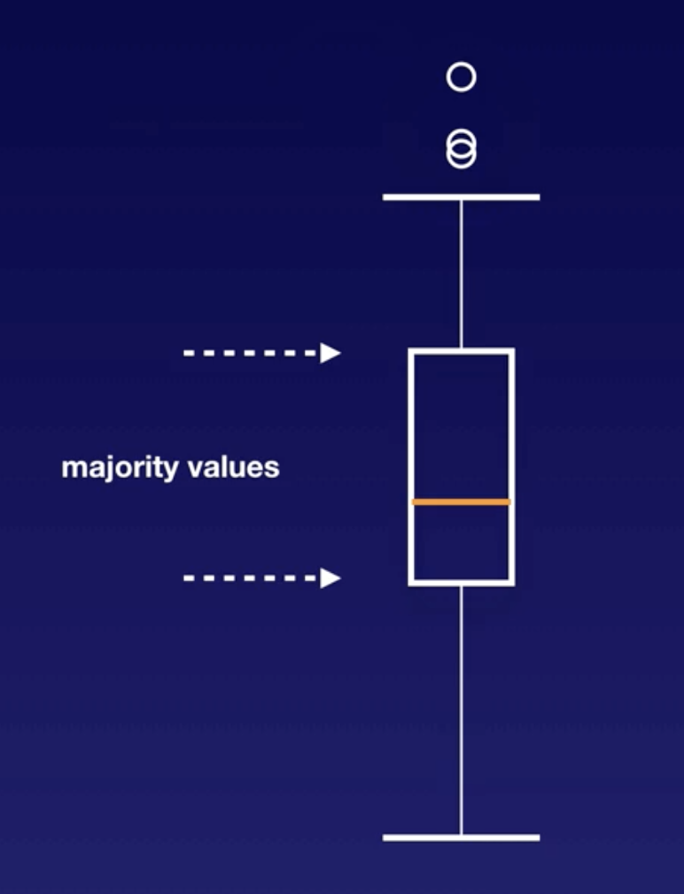 

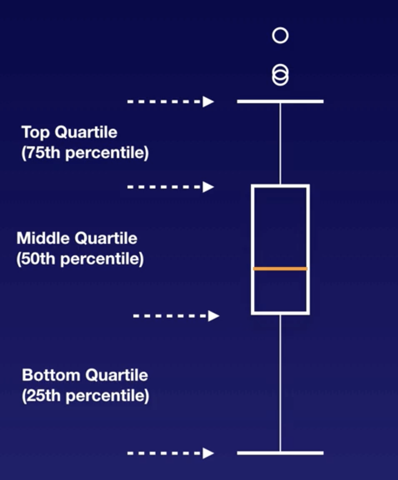

## Data Compositions

Visualising compositions of your data show the various elements and what your data is made of. 

3 types of charts for we can look at for visualising data compositions:

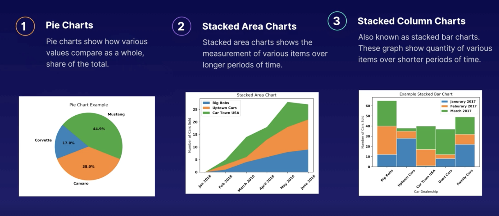

## Choosing a Visualisation

Common questions on the exam. 

3 types of charts for we can look at for visualising data distributions:

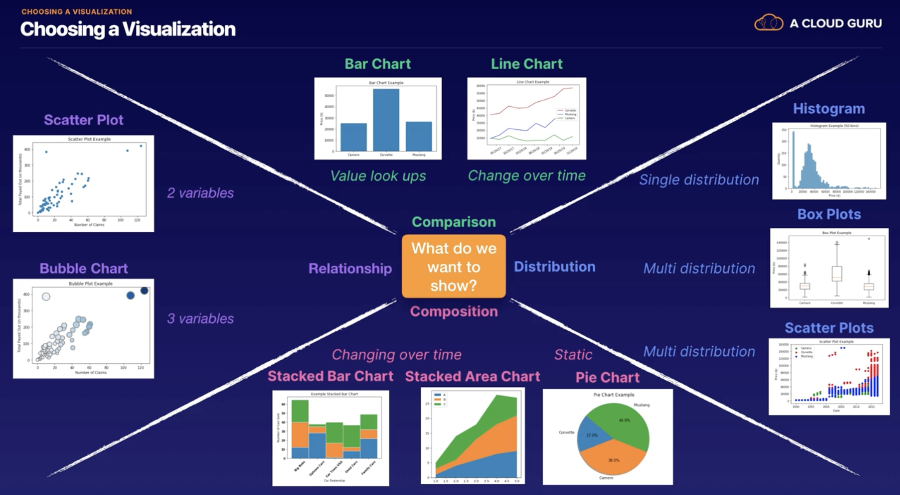

## Heatmaps

- Graphs that represent values as colour. As the values change, the colour representing that value changes too. 
- Lots of different variations of heatmaps

Heatmap Example:

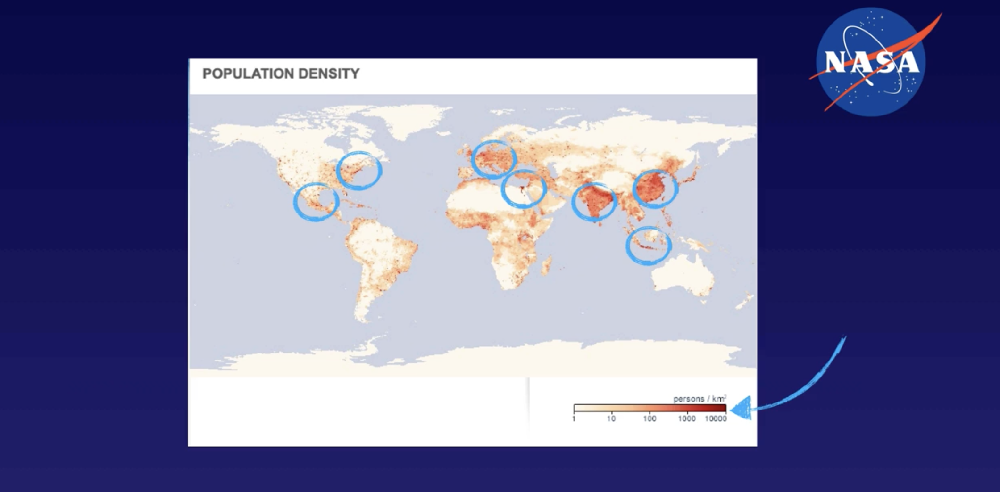

## Exam Tips

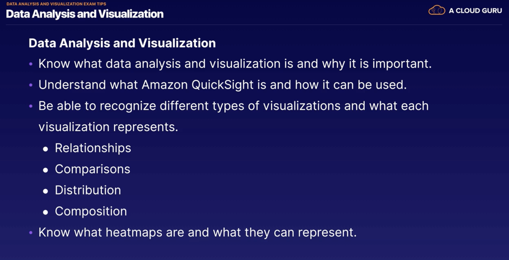
