# Modelling 

This chapter is all about training our models. 

## Modelling Concepts

### Model components

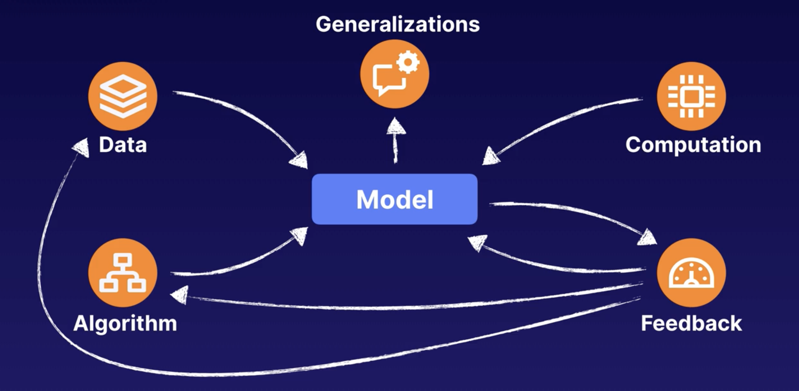

### Developing a good model

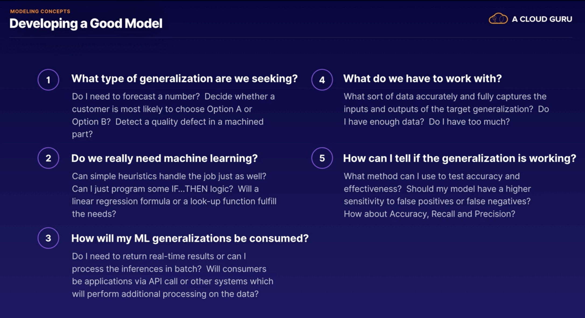

### Example Types of Models

These will all be covered in more detail in future lectures, but are introduced here at a high level. 

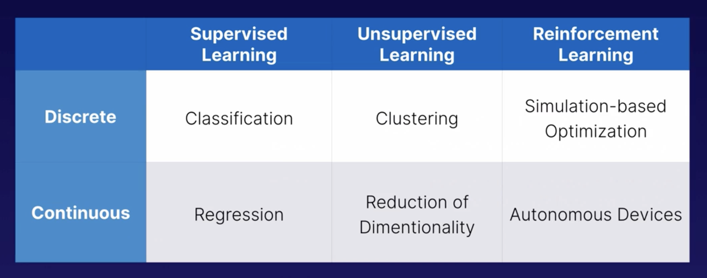

### Choosing the right approach to an ML problem

Examples:

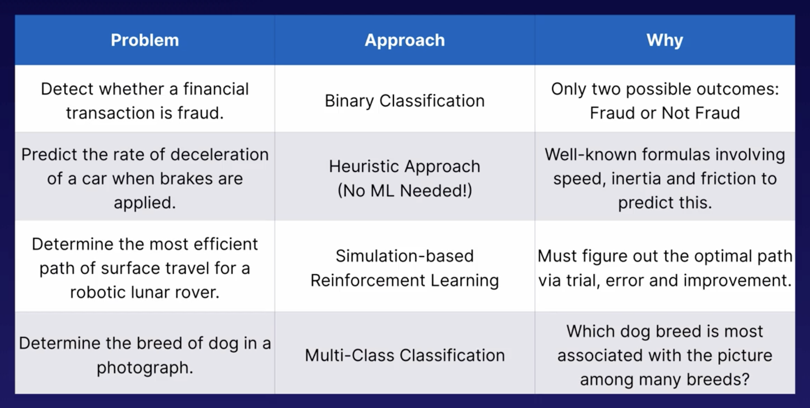

After we need to stack algorithms on top of one another... there is not one simple algorithm as an answe
to a problem e.g. 

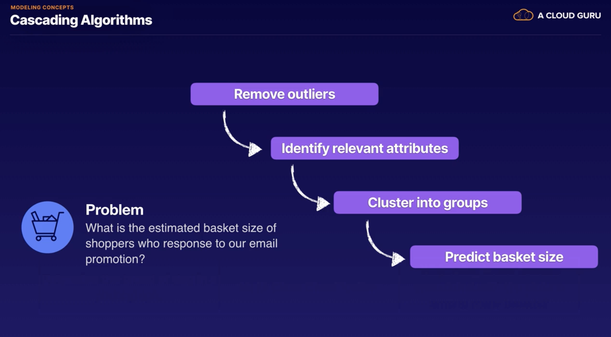

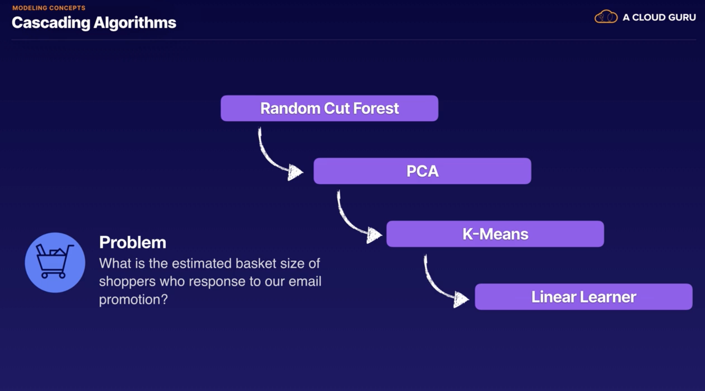

### Confusion Matrix

Depending on the problem, either false positives or false negatives might be okay - depends on whether you want to get
higher recall or high precision - when you evaluate your model you want to be thinking about whether Recall or Precision 
is more important for you. 

## Data Preparation 

Note - we want generalisation, not memorisation i.e. we want our model to perform in 'unknown' situations, 
not just the exact situations it's trained on. 

To achieve this, we can... 

- Use most of our data to train our model, but reserve some data to see if the model has really learned to
generalise and not just repeat what we've already shown it.
- We have **training data** and **testing data** - usually around 70%-80% training data and 20-30% testing data.
- Exactly sequence of events:
    1. Randomise - to make sure it is equally mixed and we have good statistical sampling between the training 
    and testing data
    2. Split
    3. Train
    4. Test
- **Sequential Split Strategy** - when using time series data, the latter period of time would be used for testing e.g. 
if there are 8 months of data, we might take the most recent 2 months as testing data 
- **K-Fold Cross-Validation Method** - k here means how many times are we going to fold the data. Once we have done each of 
these folds (rounds of splitting slightly differently), we then compare the error rate of each of the rounds. If the 
error rates across the rounds are approximately the same, then we can be pretty confident that our data is randomised,
however, if there's a significant difference, then that may give us a hint that our data was not as random as we 
thought it was, and we may need to go back and look at it a bit closer.

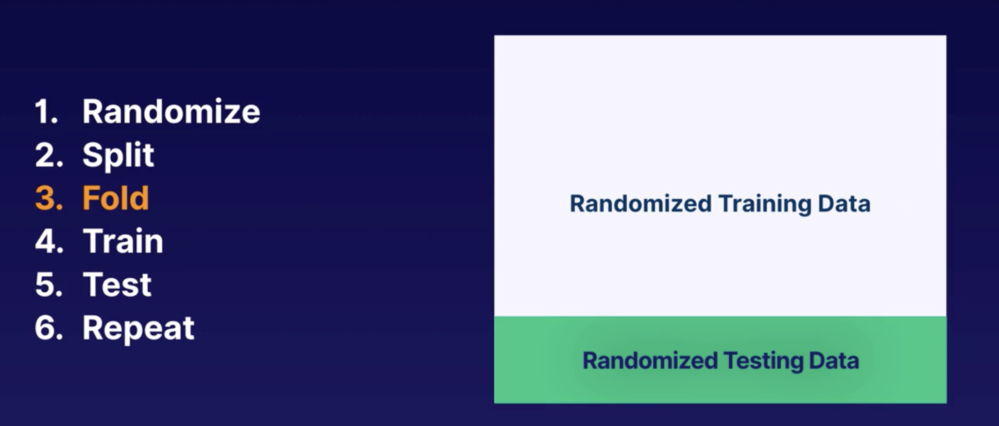

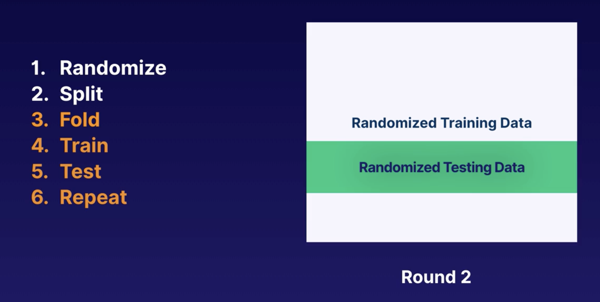

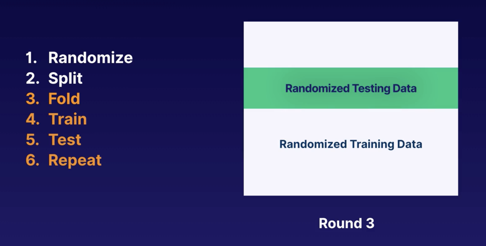

## SageMaker Modelling

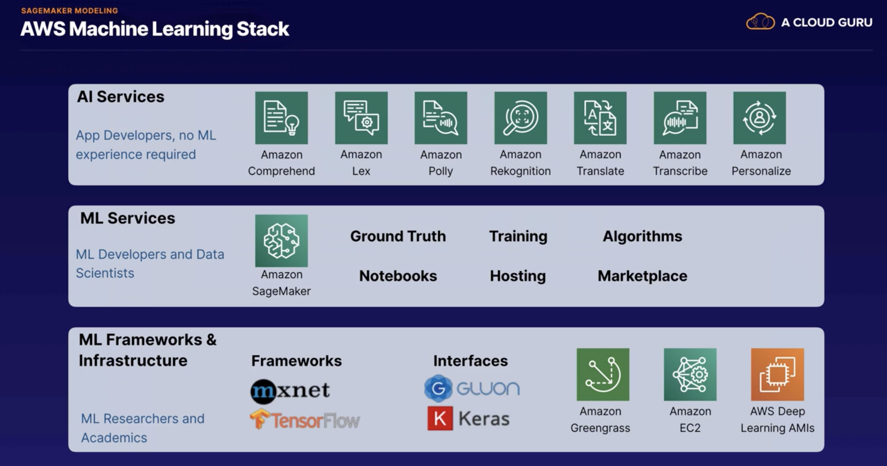

Focusing on Amazon SageMaker...

It has 4 key areas:
    1. Ground Truth - set up and manage labelling jobs for training datasets using active learning and human
    labelling
    2. Notebook - access a managed Jupyter Notebook environment
    3. Training - train and tune models
    4. Inference - package and deploy your ML models at scale
    
Here, we will focus on the **Training** area.

To submit jobs to SageMaker, you have 4 different options:

1. Via the SageMaker Console
2. Via SageMaker SDK
3. Via Jupyter Notebooks with python libraries
4. Using Apache Spark

All of these model methods have roughly the same way of staging your data (there's a slight difference with Spark, 
which we will cover later):

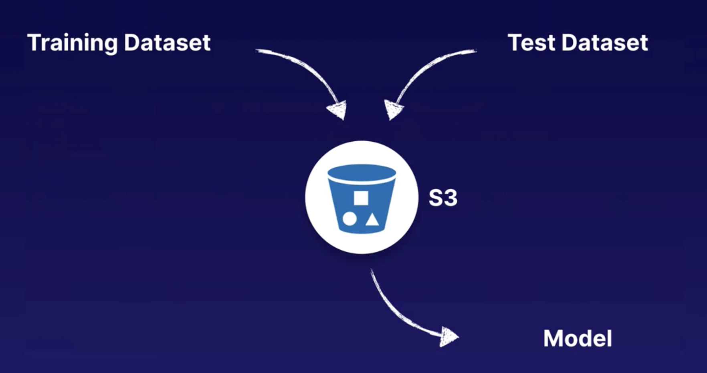

Types of data formats that are supported for model training/testing data are shown below. Different algorithms accept 
different data formats (can find recommendations on this in the documentation):

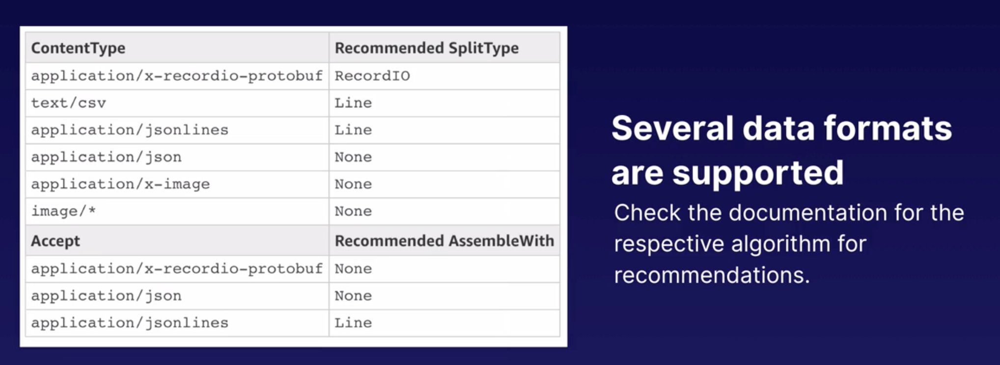

Most SageMaker algorithms accept csv:
- The Target Value should be in the first column with no header
- Be sure the metadata Content-Type is 'text/csv' in S3:

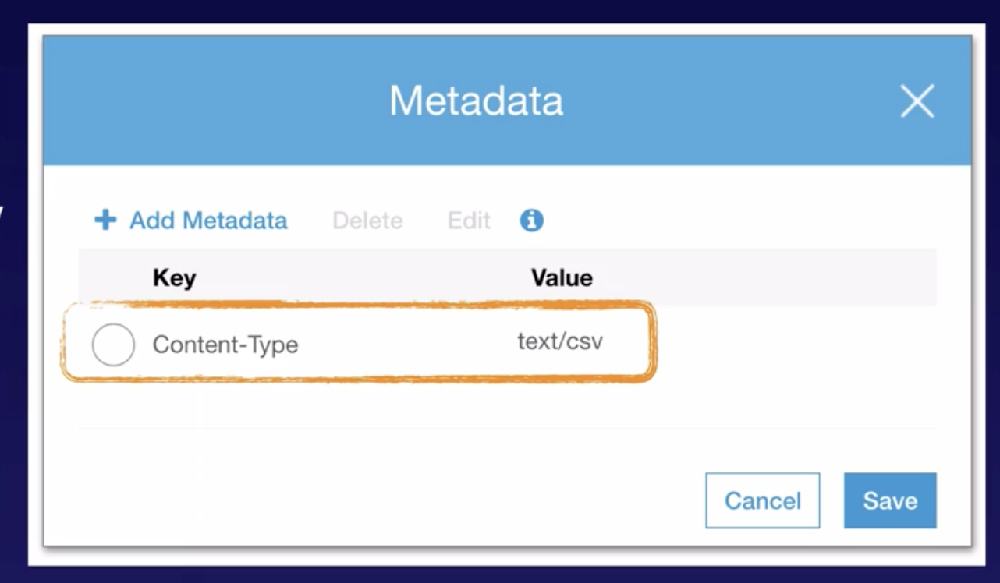

- For Unsupervised algorithms, we need to specify the absence of labels:

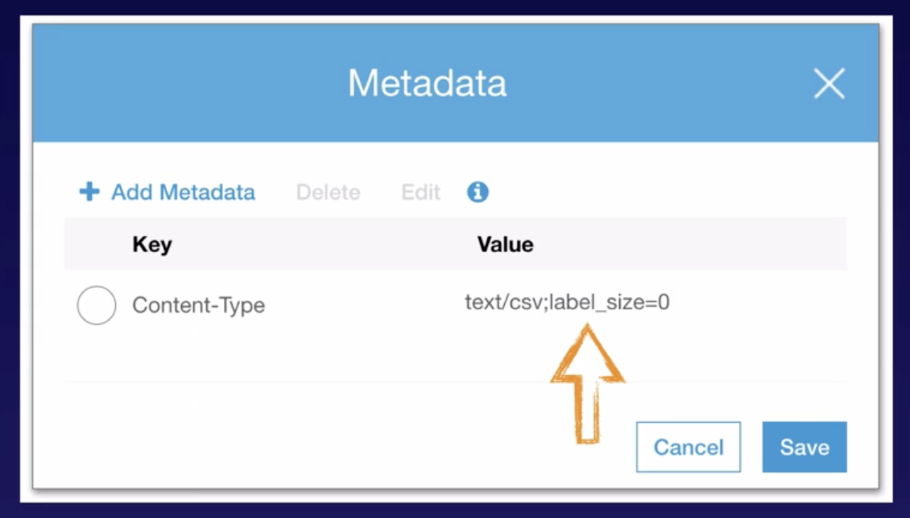
    
**For optimal performance the *optimised protobuf recordIO* format is recommended. Using this format, we can take 
advantage of Pipe mode. The advantage of recordIO and Pipe mode is that the data can be streamed from S3 to the 
learning instance, requiring less EBS space and faster start-up.**
    
As mentioned above, there are 4 main options for creating a training job. They all use:

CreateTrainingJob API 

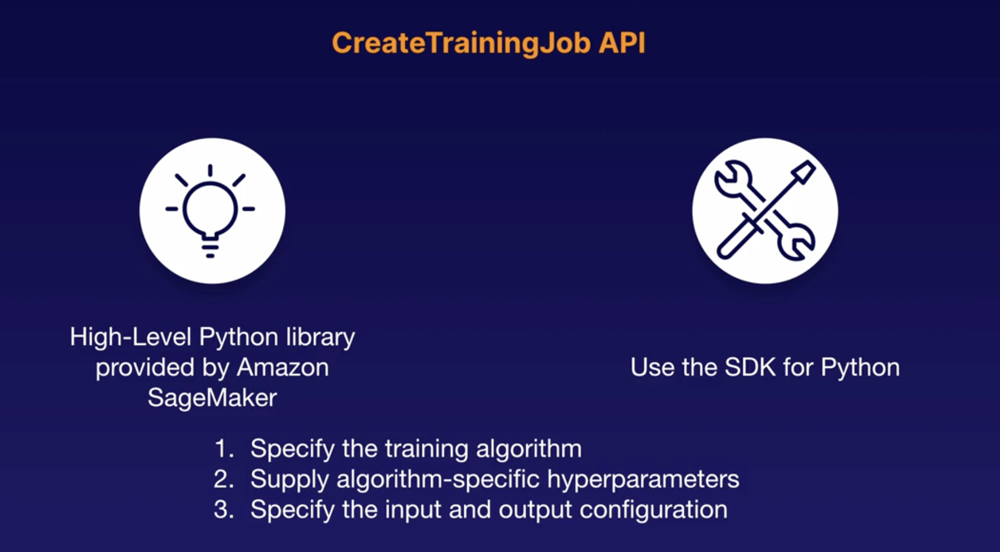

Example code:

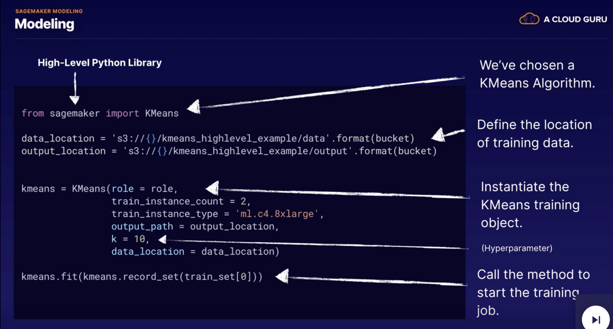

### Hyperparameters Info

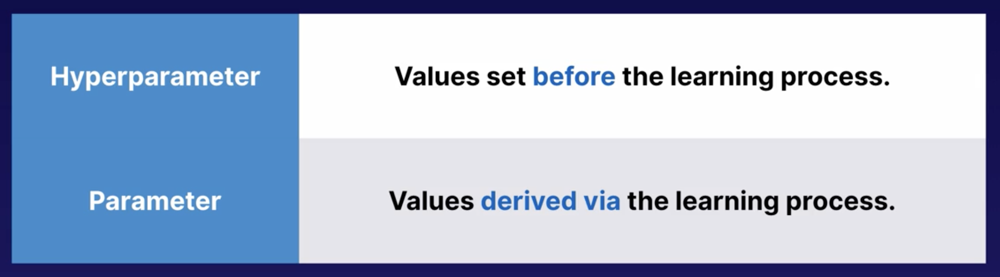

e.g. when geo-caching...

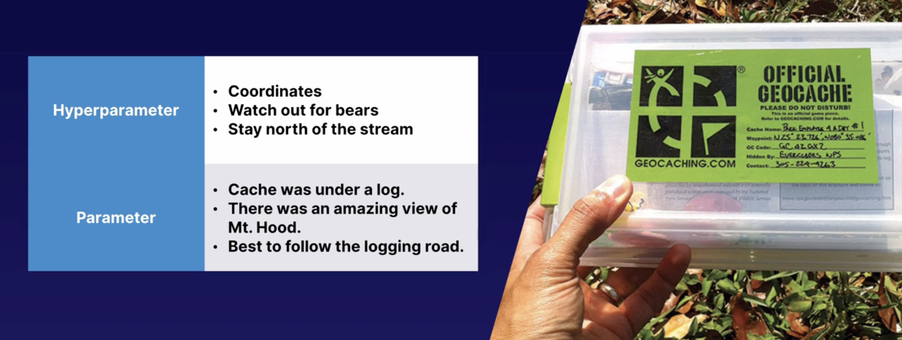

## SageMaker Training 

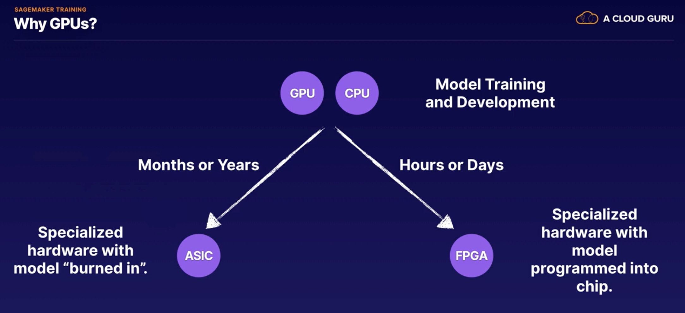

What actually happens when we submit a training job to SageMaker... 

- AWS has an Elastic Container Repository, which contains all sorts of containers for each algorithm that it 
supports. 

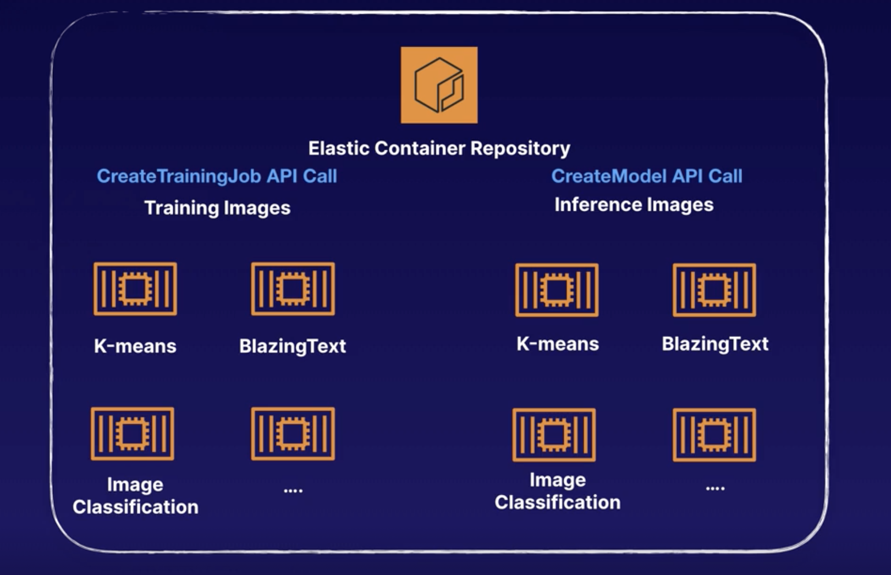

- It has training images and inference images for each algorithm:
    1. Training images are used for training (this is)
    2. Inference images are used for when we think we have a model good enough for production, we would deploy that 
    model onto one of those inference images.
- Note, the training part is much more math intensive, therefore it's quite common to carry out the training on a very 
big, high-powered, GPU instance; and then deploy into production on a less costly CPU instance. 
- There are 2 different API calls here:
    1. CreateTrainingJob API Call
    2. CreateModel API Call
- AWS has created these Image repositories in different regions - it's most common to use a region near you
- The training images are named differently depending on which algorithm you use
- The Training Image and Inference Image Registry Path is the path to the ECR image for a given algorithm. If using the 
SageMaker Python library, it will automatically know most paths. Note the Tag attribute here - it is a form of 
versioning for the repository - Use :1 version tag to ensure a stable version. Use :latest version tag for up-to-date
but potentially not backward compatible. **Use :1 for production purposes.**
- We can see here what Training Input Modes are available for each algorithm (File or Pipe)
- We can also see the format of data accepted by the algorithm - recall that recordIO protobuf has the best performance.
- We can also see the instance required for the algorithm - note that some are GPU only or CPU only

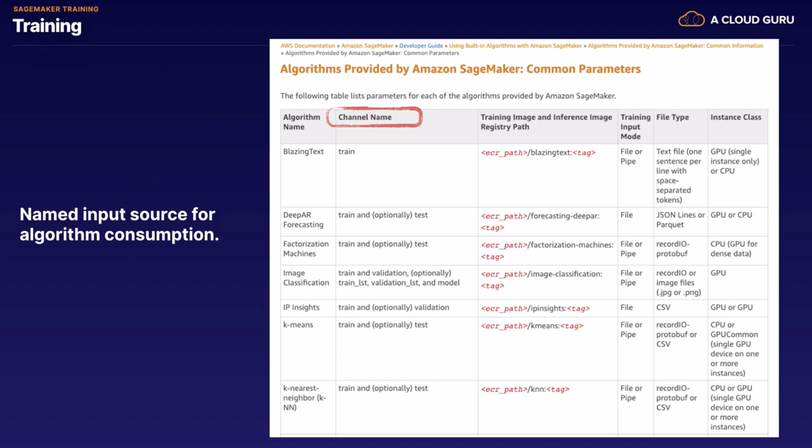

Once we submit our job to SageMaker, SageMaker will go to the Elastic Container Repository and fetch the proper image,
and then spin up that image inside our SageMaker space. Once that training job has been spun up, it can go out and access
the data on S3 that we told it about. 

Can also specify your own dockerfile if you have your own custom algorithm. You upload your dockerfile into your
own repository and then you can call the CreateTrainingJob API, with the ECR path to your image.

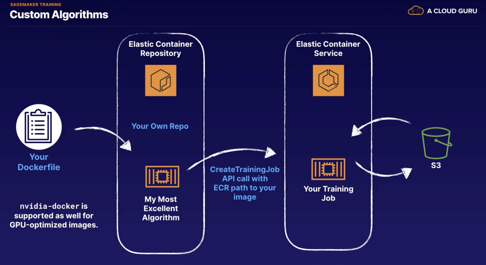

Moving on to Inference... 

When we issue the API call to deploy our model, SageMaker selects the proper Inference Image from the ECR and spins up 
the resources to support that. Again, we can use S3 as a source of data; and we could also put API Gateway
in front of it and maybe call it using REST calls from our own programme. 

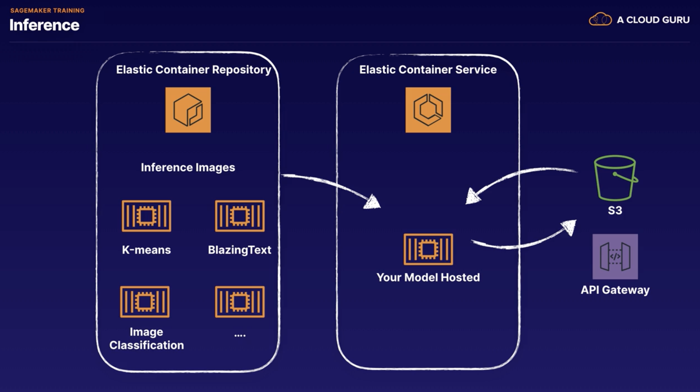

### Training process - information logged

Note - SageMaker console has click-throughs into the CloudWatch console. 

### Training with Apache Spark

- This is a little bit different. 
- We can use the SageMaker Spark Library - this converts the Spark DataFrame Format into
protobuf and then we can sent this out to S3. There there on out, it's very similar to the other training jobs
- This path can be very useful if you already have a large investment in Spark and want to use that data to create
a training job.

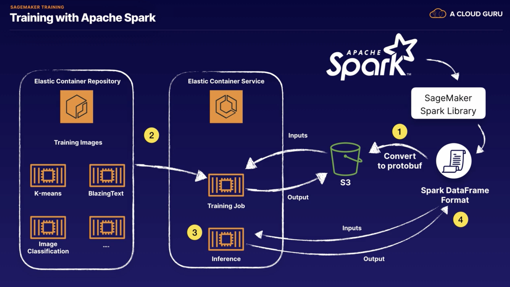

## Exam Tips

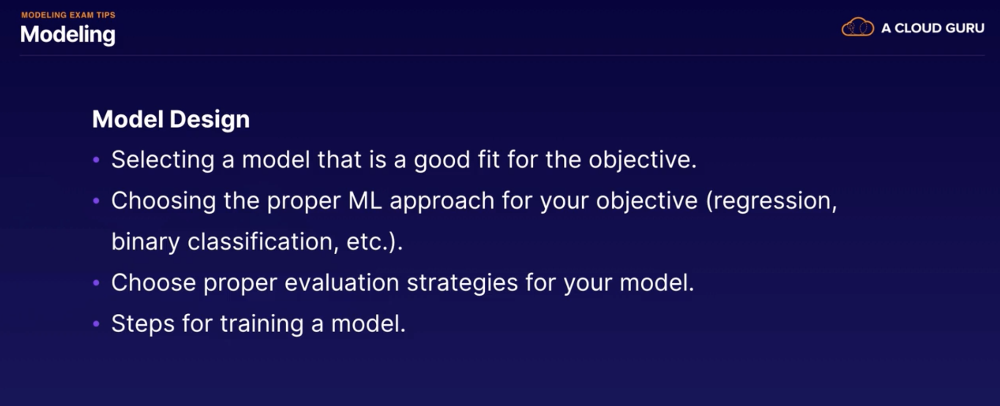

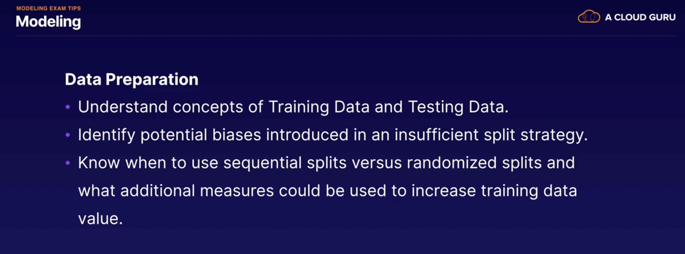

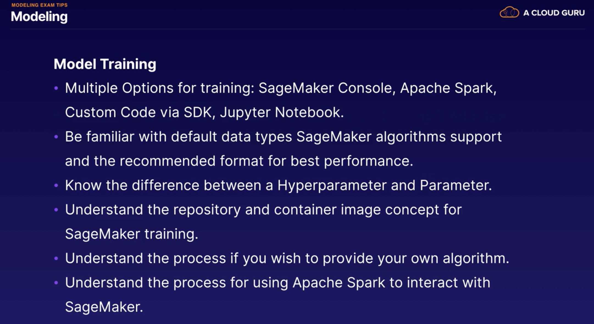

 