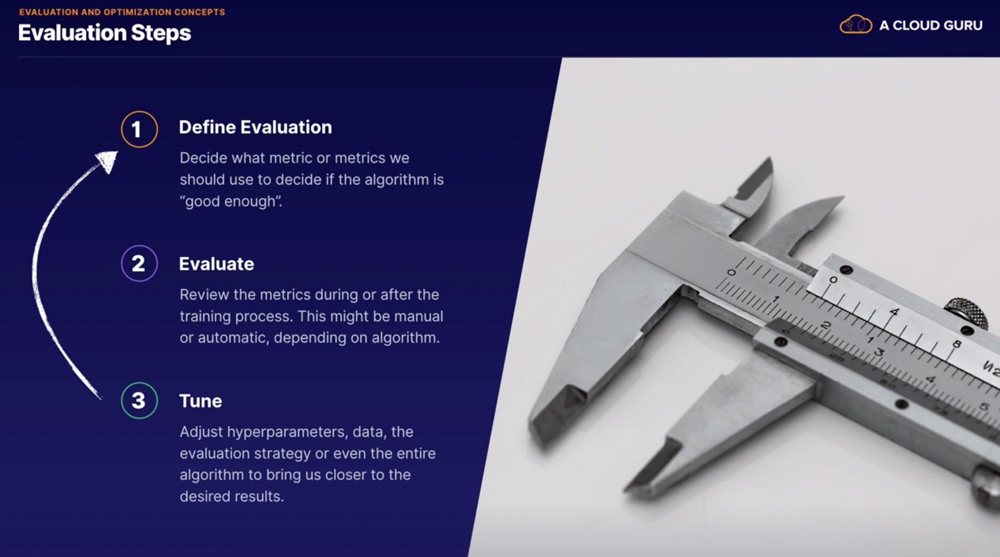
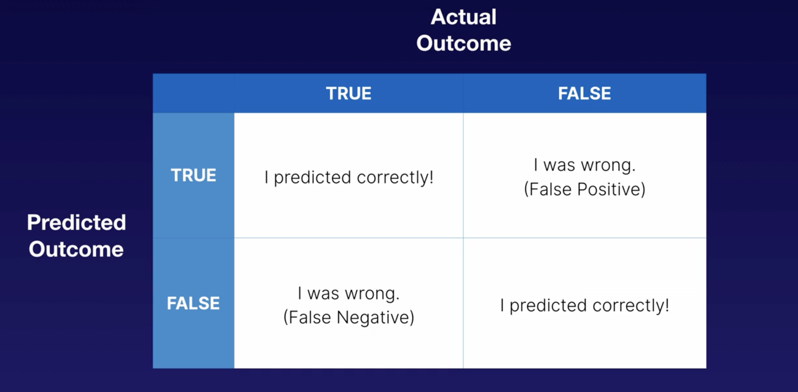

# Evaluation and Optimisation

## Concepts

Remember - we want generalisation, not memorisation. 

We therefore need to design a feedback loop to detect when we are trending in the path of memorisation or overfitting. 

Those feedback loops will then influence what we do with the algorithm/the data etc.

### Evaluation Steps

### Validation 

There are 2 general types of Validation:

#### Canary Deployments

(Traditionally - detecting toxic gases in the mines)

Imagine we have a current version of our model in production. We can redirect a fraction of traffic to our new version 
of our model and then we can watch the accuracy to try and decide, based on real world data, is the new version better
than the version we have in production currently. If it is better, then we probably look at starting to shift more and 
more traffic to the new version over time, if not, then we go back to evaluation etc...

## Monitoring and Analysing Training Jobs 

- Different algorithms have different metrics that we can evaluate them using
- These metrics are broken into 2 types - Training Metrics and Validation Metrics. For example, for the Linear
Learner Algorithm:

- Training metrics are generally used during the training process to see how the training process is going
- Validation metrics are used when testing your model 
- The AWS documentation provides all the metrics available, as well as the optimisation direction i.e. are you looking 
for the metric to be maximised or minimised
- SageMaker scrapes the logs of the built in algorithms (containers) and sends the metrics to CloudWatch - once they are
in CloudWatch we can view and visualise them (also have access to all individual jobs in CloudWatch Logs) - 
this is one of the big benefits of using SageMaker for ML - it has this ready-built integration into CloudWatch
- Note, EMR doesn't have this integration, so would need to set this up ourselves.
- SageMaker also provides us with the ability to send our logs from our custom algorithms to CloudWatch e.g. if we have 
a container that contains a custom algorithm, we have a training error and a validation error. When we define our
SageMaker job, we can also define the metrics that we want SageMaker to full from that custom algorithm:

## Evaluating Model Accuracy

### Underfitting

- This means that our model isn't very reflective of the underlying data shape. 
- Maybe we need some more variables to help train our model and achieve a better fit

How do we prevent underfitting?

1. Introduce more data - sometimes more data will provide enough additional entropy to steer your algorithm
away from underfitting
2. Train longer - the algorithm might need more iterations with the data to minimise error (more time to figure out
the relationships in the data etc.)

### Overfitting

- We have basically memorised the data
- This means that our model is too dependent on that specific data that we used to train. If it sees any new data, 
accuracy will likely be poor unless the data is identical to the training data
- We have trained our algorithm to memorise, rather than generalise

How to prevent overfitting?

### Robust Model

- This is what we are after
- This means that our model fits the training data but also does reasonably well on new data which it has never seen
- It can "deal" with noise in the data
- It can generalise effectively for that new data

### Regression Accuracy

- Looks at Residuals i.e. difference between actual and predicted
- A negative residual value tells you that the actual value was lower than the predicted value
- Can then create a residual distribution (histogram) - we would like to see this bell curve centered at 0, 
which suggests we are predicting too high and too low in about equal amounts. If we are centered around a negative 
number, that means we are consistently predicting too high and vice versa (this probably means we have a 
systemic flaw in our model that we should address (how to address this is covered in a later chapter)) e.g. 

#### Root Mean Square Error (RMSE)

The lower the RMSE, the better

Another way of looking at residuals here:

### Binary Classification Accuracy 

Look back at confusion matrix:

- False Positives = Type I Errors
- False Negative = Type II Errors
- **Area Under the Curve (AUC)** is a standard metric for binary classification models
- It can range from 0 to 1 and you want your score to be as close to 1 as possible
- Calculated AUC is fully supported under SageMaker
- Binary Classification Evaluation metrics:

- Precision vs Recall for Binary Classification Models:
    - Recall is the percentage of true positives across all true positives and false negatives e.g. Spam gets through
    - Precision is the percentage of true positives across all true positives and false positives e.g. Legitimate Emails
    get blocked
    - As recall goes up, precision decreases, and vice versa
    - F1 Score (this is useful, but is not always the only statistic you should be looking at - whether recall or 
    precision is more important depends on the business problem)
    
    
    
### Multiclass Classification 

Example confusion matrix:

### Improving Model Accuracy

## Model Tuning 

- Making small adjustments to the hyperparameters to improve performance of the model
- AWS documentation describes all the hyperparameters for each algorithm that it supports e.g for Linear Learner
Algorithm:

- SageMaker offers us **Automatic Model tuning**, also known as hyperparameter tuning. This find the best version of the 
model by running many jobs that test a range of hyper parameters on your dataset:

Here are the Linear Learner hyperparameters that we can use for Automatic Tuning:

- We then need to choose an Optimisation Metric for our Automatic Tuning:
    - Note that we have Training and Validation metrics here
    - AWS does give suggestions for which metrics it recommends we choose when tuning e.g. in the Linear Learner example
    below, AWS recommend using Validation metrics to avoid overfitting
    
    
    
- Optimisation Metrics may differ by how we're using an algorithm e.g. for BlazingText, if we are using the Word2Vec 
mode, Amazong recommends using train:mean_rho metric, however, if we are using it for text classification, Amazon 
recommends using the validation_accuracy metric:

- The tunable hyperparameters also differ here too:

### Bayesian Optimisation 

Example...

SageMaker starts building a probability model to start sending in better parameters for the learning_rate (i.e. more
intelligently than just randomly selecting values):

It tries to avoid costly iterations by focusing on what hyperparameter value is likely to give improvement. 

## Exam Tips

  

  

