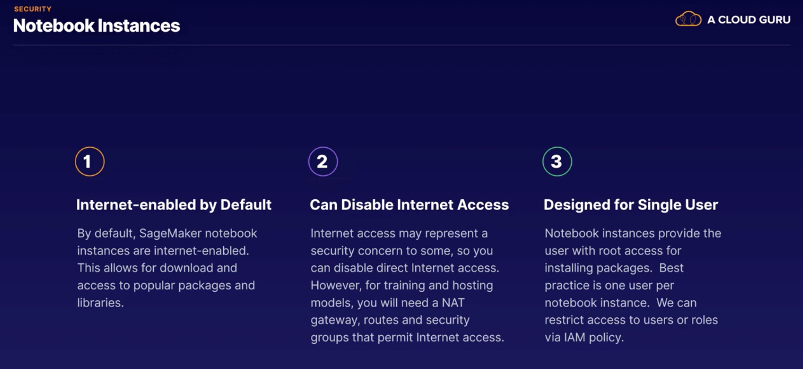

# Implementation and Operations

## Concepts

2 types of usage for our ML model:

Different types of model deployments:

"Phased Rollout" approach is one of the most common ways to deploy ML Services and therefore this is the approach
we will focus on. 

Examples of "Phased Rollout" Deployments:

1. **Rolling Deployment** - Rather than upgrade all resources at once, the upgrade is done one by one to minimise 
downtime. Example here where we have a Load Balancer and we have the algorithms behind that Load Balancer. We start 
upgrading each server one at a time to V.2.0 and as we can see here, the risk is that we have multiple versions in 
production at the same time (eventually we will fully deploy and this won't be an issue anymore):

2. Canary Deployment - Deploy a new version into production so it sees a small portion of the total traffic and evaluate
the performance and behaviour (see previous chapter for more info).

3. A/B Testing (variation of Canary) - Deploy a new version into production and configure a set amount of new inbound 
traffic to use the new (B) version, recording follow-on data about the outcome of those to use the new version. Once 
enough data is collected, make a decision on whether to fully deploy the new version or make adjustments.

A/B Testing is very common in e-commerce scenarios, where you want to evaluate whether things you did on your
website had any impact on the customers willingness to purchase a specific product. 

### Continuous Integration, Continuous Delivery & Continuous Deployment

Typical Development Lifecycle:

Old Skool:

Continuous Integration:

Continuous Delivery:

Continuous Deployment:

## AI Developer Services

1. Designed to be easy to use with no ML knowledge required
2. Scalable and Robust
3. Redundant and Fault Tolerant
4. Pay per Use (most have tiered pricing structure)
5. All accessible through either the REST API and SDK

Developer Services:

## Amazon SageMaker Deployments

- Looking here at the "Inference" section of SageMaker

2 different types of deployment explained in SageMaker terms:

Summary:
- Offline - SageMaker Batch Transform
- Online - SageMaker Hosting Services

### SageMaker Hosting Services

There are 3 main steps to creating an endpoint for your trained model:

1. Model Training - To start with, we create a training job (through the console or SDK), we feed in some training data and as we 
already discussed, SageMaker initiates a call to the Container Registry. The training process happens and the model 
artifacts for that trained model are spit out onto S3

2. Model Creation - Once the training is finished, we can create a deployable model by specifying the path
to the S3 model artifacts output from the training process and by specifying the respective container that
will do the inference for the algorithm we've chosen. We can do this by SDK or Console (console example shown below)

3. Model Creation (Retraining) - If we have deployed our model and some time has gone by, we can retrain our model as required on new
data. We can then create new versions of the model. 

4. Endpoint Configuration - Let's say we want to introduce these 2 versions into production. We need to create an 
endpoint configuration. Within that endpoint configuration, we're going to have 2 production variants for 
the 2 model versions - the production variant includes the type of instance we want to run the model on, as
well as an initial weight, which allows us to do a Canary/A/B test deployment by specifying the traffic to go to
each variant.

4. Create Endpoint - we can do this via SDK or the Console. Behind the scenes, SageMaker is going to collect the 
container image from the local Inference Container Repo and provision the resources to spin up our 2 versions. SageMaker
also creates a HTTPS Endpoint that we can then give to our Apps, so that they can then call our model. Container
logs are sent to CloudWatch and the Endpoint traffic is logged in AWS CloudTrail. From our App, we
can use the SageMaker API, with the InvokeEndpoint() method, to call our endpoint, and we will get back the response
from one of our production variants.

### SageMaker Batch Transform

- Batch Transforms start in a very similar manor - we issue a CreateTransformJob call, suppling the paths to 
the model artifacts and the datasets in S3. Behind the scenes, SageMaker automatically provisions the batch
resources for the appropriate container image. The containers get to work doing their inference and everything
is logged to CloudWatch. Once the Inference job is complete, the results are dropped in S3. 

### Inference Pipelines

- A SageMake model composed of a sequence of 2 to 5 containers which can process data as a flow. These can be 
built-in algorithms or your own custom algorithms in Docker containers.

### Amazon SageMaker Neo

- Enables a simplified way to optimise ML models for a variety of computing architectures such as ARM, Intel and 
nVidia processors
- Consists of a compiler to concert the ML model into an optimised binary and a runtime to execute the model on the 
target architecture

e.g. 

### Elastic Inference (EI)

- Speeds up throughput and decreases latency of real-time inferences deployed on SageMaker Hosted Services using 
only CPU-based instances, but much more cost-effective than a full GPU instance
- Must be configured when you create a deployable model and EI is not available for all algorithms yet

### Automatic scaling of SageMaker Models

- Dynamically add and remove instances to a production variant based on changes in workload
- You define and apply a scaling policy that uses a CloudWatch metric and target value such as 
*InvocationsPerInstance*
- We define: the min and max number of instances, a target metric, and a cool down:

  
  
    - A cool down period exists to smooth our scale up and scale down. It's basically a buffer to allow for the newly
    introduced instances to spin up and take on some load before launching another instance
    
    

- Note that if the traffic drops to zero, SageMaker won't scale down. This is because CloudWatch doesn't emit
metrics with a zero value. Therefore you either have to figure out some way to send minimal requests to the 
endpoint so that it ramps down, or you can change the maximum capacity to match the minimum capacity manually.

### High Availability with SageMaker

- AWS strongly recommends we use multiple instances for mission-critical endpoints
- AWS will automatically distribute those multiple instances over separate availability zones, to guard
against an AZ failure
- If we have multiple instances in multiple AZ and one AZ goes down, CloudWatch recognises how many instances
we originally specified and spins up another instances in another AZ as required

## Other ML Deployment Options 

- The model would still be created using SageMaker and model artifacts would still be output to S3:

### Deploying with ECS

- We would simply use the proper Inference image from the Container Repository, and then we would deploy that ourselves, 
using ECS
- We could either manually deploy on an EC2 instance/a fleet of instances that we manage; or we could use
AWS Fargate to automatically provision the resources for our ML containers

### Deploying with EC2

- We would select one of the Deep Learning AMI's from the AMI catalogue and use that
- We would spin up our own EC2 instance using that AMI and we would select the instance type that is 
appropriate for the algorithm that we're using e.g. CPU/GPU/A memory heavy instance etc.
- We could even create an API Gateway front end to serve up as a REST API for our interface model

### Deploying with EMR (Spark)

- We could deploy to an EMR cluster using Spark

### SageMaker with Spark

- Additionally, by using the SageMaker Spark SDK, we can make use of an existing Spark landscape to preprocess data
or even source data from an existing Hadoop data warehouse either on-prem or running on EMR

### Deploying Locally

- Finally, we can deploy a model locally. Deploying locally works like any other model building process. 
- We would download the model artifacts from S3 and then we can load that up on our on-prem instance of, in this case,
Tensorflow or mxnet.

## Security

### Security Concepts

### Architecture for securing instances

1. In the inner layer we have Security Groups, which we can think of as little firewalls around our Instances
2. In the next layer we have Network ACL's, which govern what traffic we allow in and out of our subnets
3. Then we may also have an Internet Gateway or a NAT instance, that provides us access to the internet
4. We have a VPC Endpoint talking to S3: Improves security because it means we don't have to go through the public 
internet to access Public AWS Services, that are not held within our VPC. Additionally, it could lower our cost, because
it means we don't have to pay egress charges for the data that goes out to those services

5. When we create a model for the first time, we can tell SageMaker which subnets and security groups we want the 
SageMaker training job to use. Then SageMaker would create an Elastic Network Interface (EIP) linking the subnets
to the training containers.

### Security Implications when using Notebook Instances

(Note for point 2 - we can also set up an interface endpoint to the SageMaker services as an alternative to getting NAT
gateway etc that permits Internet access)

### IAM Policies

There are 2 main types of policies:

Example user permission policy:

### Encryption

We can think of 2 forms of Encryption:

Encryption is well incorporated into the various SageMaker products e.g creating notebook instances or
creating training jobs or creating and configuring endpoints or creating batch transform jobs. 

All the above are examples of encryption as rest, for an example of encryption in transit:

Everything is already using HTTPS, which means it's encrypted.

However, if we wanted to provide external access to our model and even perhaps sell subscriptions...

We could do something like in the below and set up an API Gateway using a custom domain with a TLS Certificate
provided by AWS Certificate Manager. We can then use a Lambda function to pass in the requests received from the 
API Gateway. 

## Monitor and Evaluate

### Amazon CloudWatch

- You can get a better idea of what CloudWatch metrics are available for SageMaker in the documentation if/when
required

- When we use SageMaker with CloudWatch, SageMake is automatically going to create Log Groups for us using 
standard naming conventions:

- We could set up a CloudWatch Alarm that monitors an accuracy metric and once it falls below a certain threshold, the 
alarm triggers a Lambda function to create a new training job

### Amazon CloudTrail 

## Exam Tips

