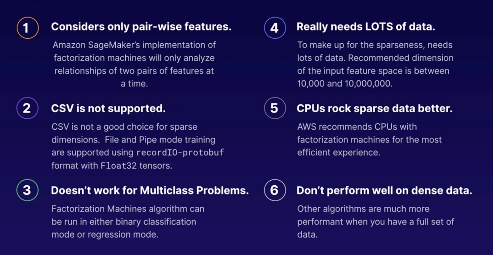
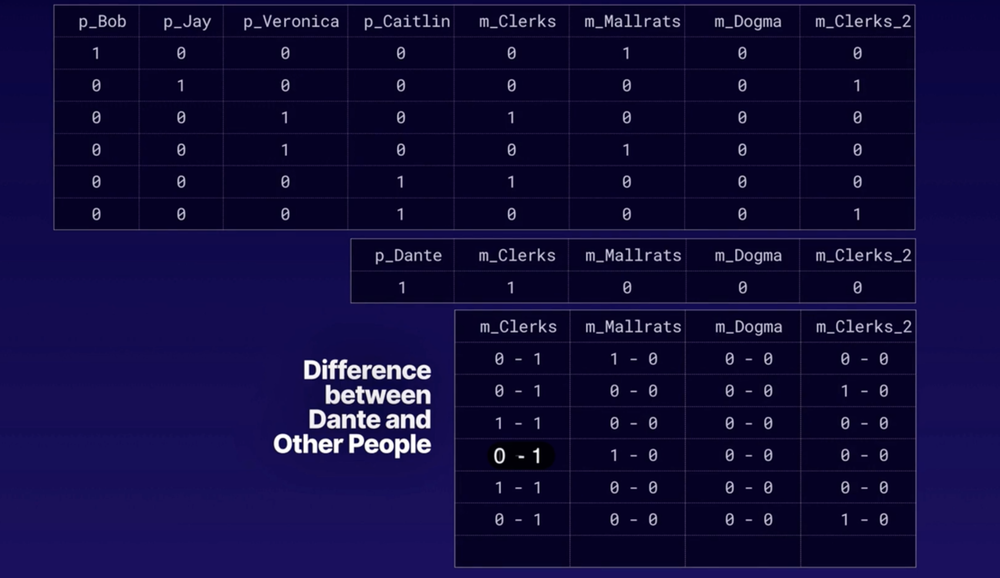
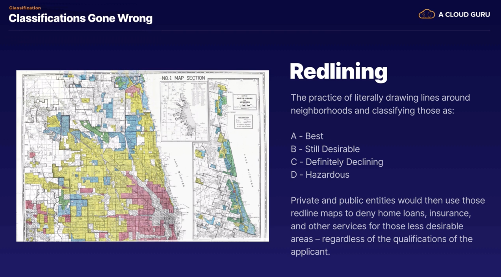
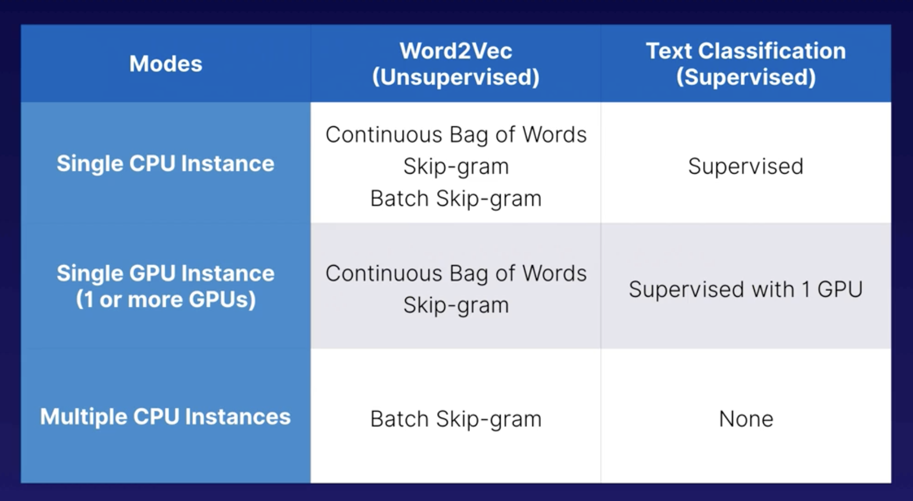

# Algorithms

## Algorithm Concepts

Official definition of 'Algorithm'- **an** unambiguous specification of how to solve a class of problems.

Why do we use algorithms in ML?

- Drive out as much bias as we can (heuristics inherently have bias, but computers can't make assumptions that require 
intuition)
- Goal is to get repeatable, generalisations

Bias can still creep in to our ML process in many ways...

1. Data selection/exclusion 
2. How we design our feedback loop when carrying out model evaluation - are we watching for a specific set of results 
due to an assumption (heuristics)
3. We could skew the model to produce outputs that fulfil our assumption in the first place

### Developing a good model

A table similar to this was also displayed in a previous chapter, but we will go through it more here:

- Supervised Learning - has a training and a testing dataset
- Unsupervised Learning - no formal training process (on the job training instead) - unsupervised learning gets it's 
data and has to figure out relationships and correlations etc as it goes
- Reinforcement Learning - all about how do we maximise the reward - we want to provide reinforcement to the model e.g. 
increased reward for doing the right thing
- Discrete processes - n number of outcomes (known number)
- Continuous processes - unlimited/continuous number of outcomes
- Reduction of Dimensionality - reduces 'noise' to get a stronger signal for what we want to look at

How can we get our algorithms?

## Regression

### Linear Learner Algorithm

- **Linear Learner Algorithm** - Linear models are supervised learning algorithms for regression, binary
classification or multi-class classification problems. You give the model labels (x,y), with x being
high-dimensional vector and y is a numeric label. The algorithm learns a linear function, or, for classification
problems, a linear threshold function, and maps a vector x to an approximation of label y.
- To use this algorithm you need a number or list of numbers which yields some other number... the answer you're after.
You can use it to predict a specific value or a threshold for grouping purposes.
- Linear Learner Algorithm uses Stochastic Gradient Descent to best fit the regression line:

(Note - Local Minimum vs Global Minimum (think pool of water vs ocean))

- For Regression, eventually the Linear Learner Algorithm settles in on a formula that it thinks represents the data. 
That then gets run through the testing phase etc:

- Can also use Linear Learner for Classification Problems - needs numeric values so need to map text values to a number 
representation:

Linear Learner Summary:

When to use Linear Learner?...

Linear Learner works well if we have good, continuous data... however if we have missing values etc i.e. a sparse 
dataset, Linear Learner works less well. Here we can instead use Factorisation Machine Algorithm.

### Factorisation Machine Algorithm

- General purpose supervised learning algorithm for both binary classification and regression. Captures
interaction between features with high dimensional sparse datasets.
- To use this algorithm you need a number or list of numbers which yields some other number... the answer you're after.
You can use it to predict a specific value or a threshold for placing into one of two groups. It is a good choice
when you have "holes" in your data.

Factorisation Machine Algorithm limitations:

Factorisation Machine Algorithm very simple Example:

We want to recommend a movie to Dante...

These matrices can get ridiculous, which is why csvs are not the right way to go here (see above limitations).

When to use Factorisation Machine Algorithm?...

## Clustering 

- Set of unsupervised algorithms (i.e. no training data required) that aim to group things such that they are with other things more similar than
different
- We specify which columns/features of our data we want the clustering algorithms to take into account when deciding
how to group things

### K-Means Algorithm 

- Unsupervised algorithm that attempts to find discrete groupings within data, where members of a group are as
similar as possible to one another and as different as possible from members of other groups. The Euclidean distance
between these points represents the similarity of the corresponding observations. 
- K-Means will take in a list of things with attributes. You specify which attributes indicate similarity and the 
algorithm will attempt to group them together such that they are with other similar things. "Similarity" is calculated
based on the distance between the identifying attributes.

Things to know about K-Means...

- An interesting use case for K-Means is in Audio Signal Processing - allows analogue signals to be translated into 
digital signals of 1's and 0's:

We do lose some signal variation when we translate into 1's and 0's during the digitisation process.

- We can also use clustering for something like handwriting recognition e.g. cluster similar looking images - analyse 
each pixel in an image, determine in this case if it's a black or white pixel, then store the coordinates of that 
pixel, most likely as a vector, then we can compare the vectorised black and white coordinates for example
to the MNIST dataset to cluster the image with other images that look similar. 

## Classification 

### K-Nearest Neighbour

- Supervised algorithm - we will need to train the model here
- An index-based, non-parametric method for classification or regression. For classification, the algorithm queries the
k points that are closest to the sample point and returns the most frequently used label as the predicted label. For 
regression, the algorithm queries the k closest points to the sample point and returns the average of the feature
values as the predicted value.
- Predicts the value or classification based on that which you are closest. It can be used to classify or to predict a 
value (average value of nearest neighbours)

Things to know about K-Nearest Neighbour...

K-Nearest Neighbour use cases:

*We need to be aware of **bias** with K-Nearest Neighbour, as it is a method of stereotyping e.g.*

## Image Analysis

- Another form of classification, but looking at images. 
- Usually image analysis models also return a confidence score - we can set an accuracy threshold. 
- **Amazon Recognition** - covered later, but this is AWS's image analysis service.
- Note - ImageNet is a huge database of labelled images that we can use when training an image analysis model 
(this is an example of Transfer Learning - we are benefiting from the work of others to make our model better)
- Algorithms available in SageMaker that we will discuss here:

Things to know about Semantic Segmentation...

Note - CITYSCAPES dataset is a website similar to ImageNet, but for semantic... 

e.g. we could use this to create a self-driving model car - the point about them being able to be deployed on CPU 
instances aids this too, as it means the model can fit in something like a small car/space rover etc.

Image Analysis use cases:

## Anomaly Detection

### Random Cut Forest 

- Unsupervised learning
- Detect anomalous data points within a set, like spikes in time series data, breaks in periodicity or 
unclassifiable points. Useful way to find outliers when it's not feasible to plot graphically. RCF is designed to work
with n-dimensional input.
- Find occurrences in the data that are significantly beyond "normal" (usually more than 3 standard deviations) that 
could mess up your model training.

Things to know about Random Cut Forest...

Logic behind Random Cut Forest: algorithm makes random 'cuts' and analyses what lies on one side of the cut and what
lies on another. 

Random Cut Forest use cases:

### IP Insights

- Unsupervised learning
- Learns usage patterns for IPv4 addresses by capturing associations between IP addresses and various entities
such as user IDs or account numbers
- Can potentially flag odd online behaviour that might require closer review

Things to know about IP Insights...

IP Insights use cases:

## Text Analysis 

### Latent Dirichlet Allocation (LDA)

- LDA algorithm is an unsupervised learning algorithm that attempts to describe a set of observations as a mixture
of distinct categories. LDA is most commonly used to discover a user-specified number of topics shared by documents 
within a text corpus. Here, each observation is a document, the features are the presence (or occurrence count) of
each word, and the categories are the topics.
- Used to figure out how similar documents are based on the frequency of similar words.

LDA use cases:

### Neural Topic Model

- Unsupervised learning algorithm that is used to organise a corpus of documents into topics that contain words groupings
based on their statistical distribution. Topic modelling can be used to classify or summarise documents based on the topics
detected or to retrieve information or recommend content based on topic similarities.
- Similar uses and function to LDA in that both NTM and LDA can perform topic modelling. However, NTM uses a 
different algorithm which might yield different results than LDA.

### Sequence to Sequence (seq2seq)

- Supervised learning algorithm where the input is a sequence of tokens (e.g. text/audio) and the output 
generated is another sequence of tokens
- Think a language translation engine that can take in some text and predict what that text might be in another
language. We must supply training data and vocabulary

Things to know about Sequence to Sequence...

Sequence to Sequence use cases:

### BlazingText

- Supervised/Unsupervised
- Highly optimised implementations of the Word2vec and text classification algorithms. The Word2vec
algorithm is useful for many downstream NLP tasks, such as sentiment analysis, named entity recognition, machine 
translation, etc.
- Really, really optimised way to determine contextual semantic relationships between words in a body of text.

BlazingText Modes:

Things to know about BlazingText...

BlazingText use cases:

### Object2Vec

- Supervised learning
- This is an elaboration of Word2Vec
- General-purpose neural embedding algorithm that can learn low-dimensional dense embeddings of high-dimensional
objects while preserving the semantics of the relationship between the pairs in the original embedding space.
- A way to map out things in a d-dimensional space to figure out how similar they might be to one another.

Word2Vec vs Object2Vec:

Can then group things to give a music album recommendation to person 4:

Things to know about Object2Vec...

Object2Vec use cases:

## Reinforcement Learning 

- When we think of Reinforcement Learning...we generally have 2 strategies we can employ - 
positive reinforcement/negative reinforcement.
- Reinforcement Learning (RL) in ML follows the same basic principles. 
- RL is an ML technique that attempts to learn a strategy, called a policy, that optimises for an agent acting
in an environment. Well suited for solving problems where an agent can make autonomous decisions.
- Find the path to the greatest reward

### Markov Decision Process (MDP)

- We have an Agent
- The Agent is in an Environment
- We need a concept of a Reward
- We need the State - the info about the environment and any past steps that might be relevant to any future steps
- We need the Actions that the Agent can perform
- We have the Observation - the info available to the Agent at each State/each step
- Episodes - iterations that the Agent takes from start to finish whilst it is accumulating reward
- We are after the Policy - the decision making part of the model that will make choices that will hopefully 
maximise the reward

Example of Reinforcement Learning on AWS - DeepRacer:

DeepRacer simulation using AWS RoboMaker - car drives round the track over and over again until it works out 
how best to stay on the track on the way around:

Learns based on reward - upward trend in reward by episode means that the policy in continuing to evolve:

Reinforcement Learning use cases:

## Forecasting

"Past performance is not an indicator of future results"

### DeepAR

- Supervised learning
- Forecasting algorithm for scalar time series using recurrent neural networks (RNN). DeepAR outperforms
standard autoregressive integrated moving average (ARIMA) and exponential smoothing (ETS) by training a single model
over multiple time series as opposed to each individual time series
- Can predict both point-in-time values and estimated values over a timeframe by using multiple sets of historic dats

Note - a **Cold Start Problem** means we have little or no history to use for building a forecasting model e.g. we have 
a new product and we want to know how many we can expect to sell. 

e.g. in the above scenario... we could build a model that combines the patterns of multiple similar previous products to
create an accurate forecast that is a more realistic model for our new product.

2 types of forecast we can do with DeepAR:

Things to know about DeepAR...

DeepAR Use Cases...

## Ensemble Learning

- Using multiple learning algorithms and models collectively to hopefully improve the model accuracy

One of the ensemble learning algorithms that SageMaker provides for us is...

### Extreme Gradient Boosting (XGBoost)

- Supervised learning 
- Open-source implementation of the gradient boosted trees algorithm that attempts to accurately predict a
target variable by combining the estimates of a set of simpler, weaker models.
- A virtual 'Swiss army knife' for all sorts of regression, classification and ranking problems, with 2 required and 
35 optional hyperparamteres to tune.

Things to know about XGBoost...

XGBoost Example...

e.g. What price should I ask when selling my house?

Looking at Decision Tree Ensembles...

XGBoost Use Cases...

## Exam Tips

