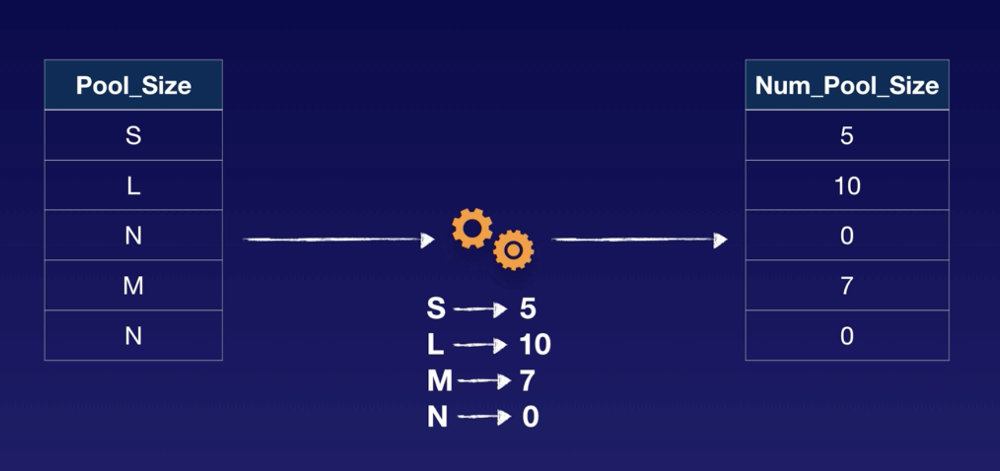
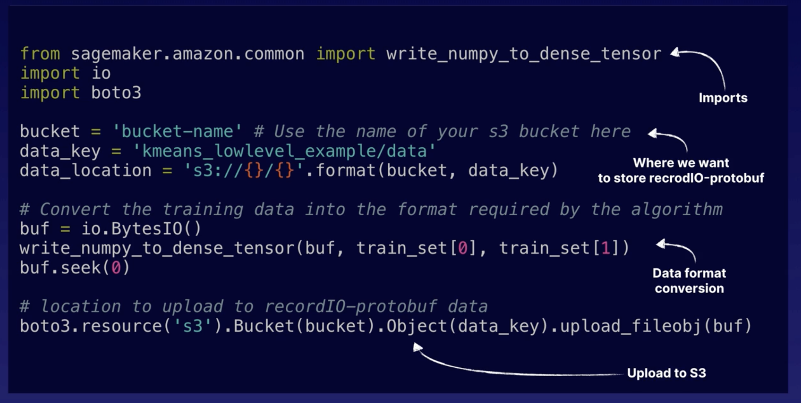

# Data Preparation

There is cleaning required before the data can be consumed for ML.

First step is understanding the data.

Data Preparation is the process of transforming a dataset using different techniques to prepare it for model training 
and testing.

Ensure the relevant features are used for the problem at hand. 

The data preparation process is usually the most time consuming part of ML work. 

Example:

AWS tools to remember for data prep:
1. SageMaker & Jupyter Notebooks (more adhoc cleaning jobs)
2. ETL jobs in AWS Glue (more reusable cleaning jobs that can be rerun as required/on a schedule)

## Categorical Encoding

- Turing proved that anything can be encoded using 1's and 0's (Turing Machine).

- Categorical encoding is the process of manipulating categorical variables when ML algorithms expect numerical values
as inputs.

Note:

categorical variable == categorical feature == discrete feature

When should we do this encoding?

(Note, certain model types require numerical values)

Categorical Encoding Examples:

Nominal variables - order does not matter
Ordinal variables - order does matter

In depth example:

Loan_Approved - simple binary encoding:

Pool_Size - define a map, choosing sizes for small, large medium. You may need to tweak these to get the
required output:

Num_Home_Type - can't just encode these as 1, 2, 3 because these are nominal values where order doesn't matter. 
By doing 1, 2 and 3, the algorithm will think that one is 'better' than another:

 
Option instead is:

One-hot Encoding - transforms nominal categorical features and creates new binary columns for each observation:
    
One-hot encoding can lead to a problem if there are many, many variables (for obvious reasons). Then the question is, 
should we one-hot or not?

* Can instead use techniques like grouping by similarity, which could create fewer overall categories before encoding.
* Can also map rare values to "other", which can help reduce the overall number of new columns created by one-hot 
encoding.
    
### Categorical Encoding Summary

## Text Feature Engineering

- Feature engineering generally means transforming attributes within our data to make them more useful within our model 
for the problem at hand.

- Text Feature Engineering means transforming text within out data so ML algorithms can better analyse it (splitting text
into bite sized pieces).

Simple example case for text feature engineering:

Values are tokenised from one raw text string to bite sized pieces.

### Bag-of-Words

- Tokenises raw text and creates a statistical representation of the text. 
- Breaks up text by white space into single words 

Example:

### N-Gram

- An extension of Bag-of-Words which produces groups of words of n size.
- Breaks up text by white space into groups of words.

Note, N-gram, size = 1, gives the same result as Bag-of-Words.

Note, when we apply N-gram, it also produces groups less than it's size, so N-gram, size = 2 will produce tokens of 
size 2 and 1.

Example where N-gram, size = 2:

Technique could be used in a spam filter for example to find phrases such a 'Click here' or 'You're a Winner'.

### Orthogonal Sparse Bigram (OSB)

- Creates groups of words of size n and outputs every pair of words that include the first word.
- Creates groups of words that always include the first word. 

Breaking down OSB:

Note - OSB is not better or worse than N-Gram, it's just a different technique to use; one may work better than another
in certain situations.

Example:

### Term Frequency - Inverse Document Frequency (tf-idf)

- Represents how important a word or words are to a given set of text by providing appropriate weights
to terms that are common and less common in the text. 
- Shows us the popularity of a word or words in text data by making common words like 'the' or 'and' less important.

Breaking down tf-idf:

Example:

*Vectorised Tf-idf (could come up in exam):*

Syntax - (number of documents, number of unique n-grams)

e.g. (2,7) for above example where the number of documents is 2 and the number of unique n-grams is 7 

(See resource for how to vectorise)

### Use cases for these text feature engineering transformations

### Remove punctuation and lowercase transformation

- These are straight forward transformations, however are often very useful to do upfront before we do any other
type of text transformation.

Examples:

Note - punctuation inside of words considered important, so in most cases this isn't removed (e.g. apostrophes and 
hyphens)

### Cartesian Product Transformation

- Creates a new feature from the combination of two or more text or categorical values. 
- Combining sets of words together.

Example:

If a buyer buys one of these books, this could be used to create more suggestions about future books they could buy
i.e. targeted marketing.

### Feature Engineering Dates

- Translating dates into useful information 

Examples of useful information we can get:

Example of date_feature_engineering:

With this information extracted, we can then determine more important correlations/information about our
information. 

## Summary of Text Feature Engineering Methods Discussed

(There are many other transformations out there, but some of the main ones have been discussed)

## Numeric Feature Engineering

- Transforming numeric values within our data so ML algorithms can better analyse them

### Feature Scaling

- Changes numeric values so all values are on the same scale:

    * *Normalisation* (note, in the context of the exam: scaling = feature scaling = normalisation):
    
         Example: we want to apply Normalisation to the 'Price' feature. The way normalisation works is that is assigns
         the minimum value to 0 and the maximum value to 1 and then it scales the other values in between.
         
         
         
         
         
         
         
         Calculation explained (don't need to know this specifically for the exam):
         
         
         
         This is the most common and easiest method for scaling values. The problem with normalisation is that OUTLIERS
         CAN THROW OFF NORMALISATION!! 
     
    * *Standardisation*:
        
        This works by setting the average value to 0 and then uses the z-score for the remainder of the values.
        
        Using same Price example again:
        
        
        
        The z-score takes into account the price average and the price standard deviation and smooths out the values
        so that outliers are not as much of an issue
        
        Calculation explained (don't need to know this specifically for the exam):
        
        
        
Feature Scaling Summary:

    
### Binning

- Changes numeric values into groups or buckets of similar values
    * Quantile Binning aims to assign the same number of features to each bin
    
We can use binning when we know that a numeric feature within our dataset doesn't have a linear role with our prediction
or our target attribute i.e. if we know that the increasing/decreasing of the numeric feature doesn't have any 
correlation with our target attribute, then that feature is a great candidate for binning. 

Often a person's age is a good candidate for binning e.g. we don't care so much about whether somebody is 51 or 52, 
but we care more about the life stage of a person's age. 

Can then use the bins as categorical variables.

Example:

The drawback with setting a fixed number of bins is that we may have irregular bins/the bins are not uniform
with the number of data points. We are looking for more even distribution between the values that are in the bins.

To overcome this, we can apply a technique called Quantile Binning:

Same Example once we have applied Quantile Binning:

Note - after we have done this, we can assign a categorical variable to each bin, for example: 

'Youth', 'Young Adult', 'Adult'

... and then we can use other transformation techniques to hopefully find better correlation with our target attribute

Example whole process explained:

Binning Summary:

### Numeric Feature Engineering Summary

## Other Feature Engineering

* *Image Feature Engineering* - can be done to extract useful information from images before using them with ML
algorithms. A lot of these techniques are out of the scope of the exam, but worth covering to give a more complete idea
of feature engineering.

Simple example problem:

Is this character a number - humans could look at the picture and know that it is the number 3, the way we can feature
engineer this image is by breaking the image up into a grid and then translating the values in the grid that are black 
to 1 and that are white to 0. 

This grid of 1's and 0's can then be compared against other known images of numbers to work out if the image is of a 
number (e.g. the MNIST dataset).

* *Audio Feature Engineering* - can be done to extract useful information from sounds and audio before using them with ML
algorithms. 

Example simple audio stream - can be sampled at different points in time to give a data set of amplitude values
that actually represent the audio stream in numeric format.

### Dataset Formats

Amazon allows 2 different modes: File (most traditional), and Pipe (provides faster start times for our training jobs/
our algorithms and provides better throughput).

Notes - recordIO-protobuf is a file type. A tensor is a mutli-dimensional array.

Example python code to create a recordIO-protobuf (will go into this more in detail in the algorithms chapter
and in the hands on labs):

## Handling Missing Values

Missing values in your datasets can interfere with analysis and model predictions.

Missing data can be represented in many different ways:

- null
- NaN
- NA
- None
- etc...

Handling missing values is an important data preparation step.

It is important to understand why values are missing in order to make a decision about how to handle them. 

Missingness Mechanisms - why is data missing:

Techniques to handle missing values:

Note - replacing data is known as *data imputation*.

May get questions on the exam asking which technique to use to handle missing values.

## Feature Selection 

- Selecting the most relevant features from your data to prevent over-complicating the analysis, resolving potential
inaccuracies, and removes irrelevant features or repeated information.
- Feature selection is an intuitive step humans take to reduce the number of features.

Example:

### Principal Component Analysis (PCA)

 - An unsupervised learning algorithm that reduces the number of features while still retaining as much information
 as possible.
 - This can be extremely helpful if we have 100's of features
 
### Feature Selection Use Cases

 

